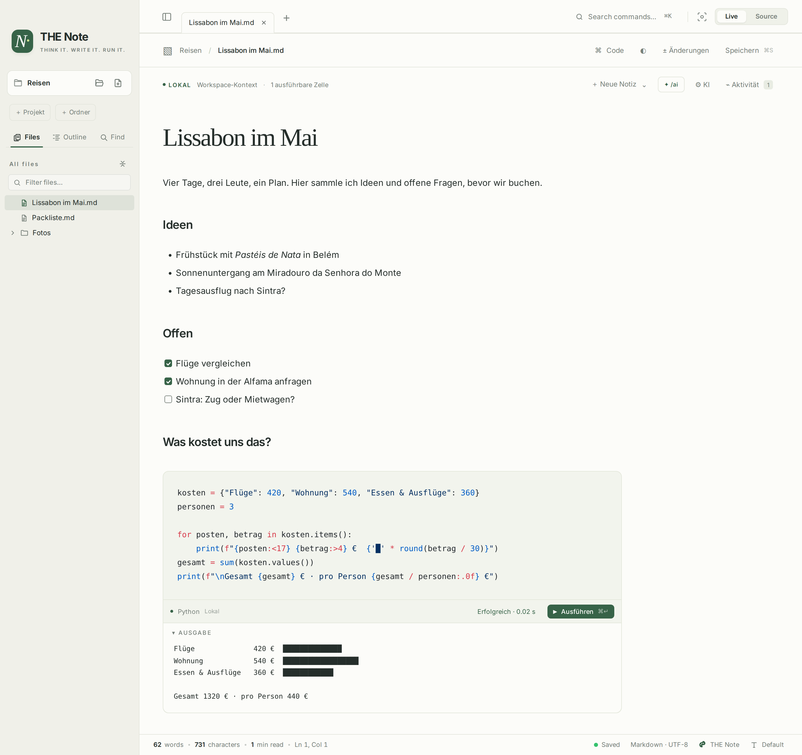
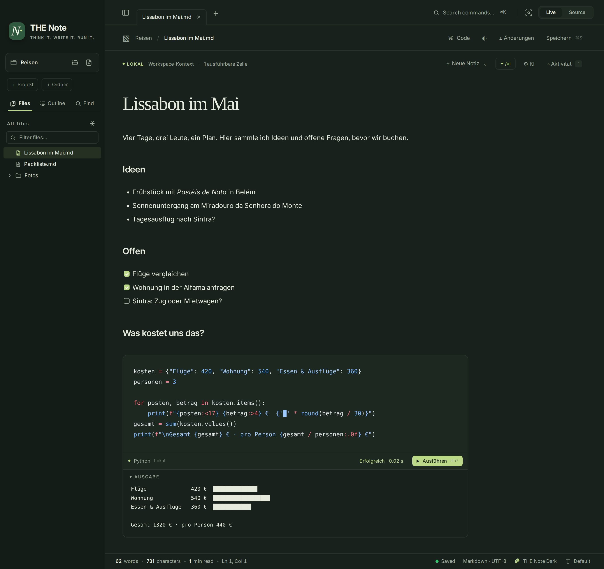
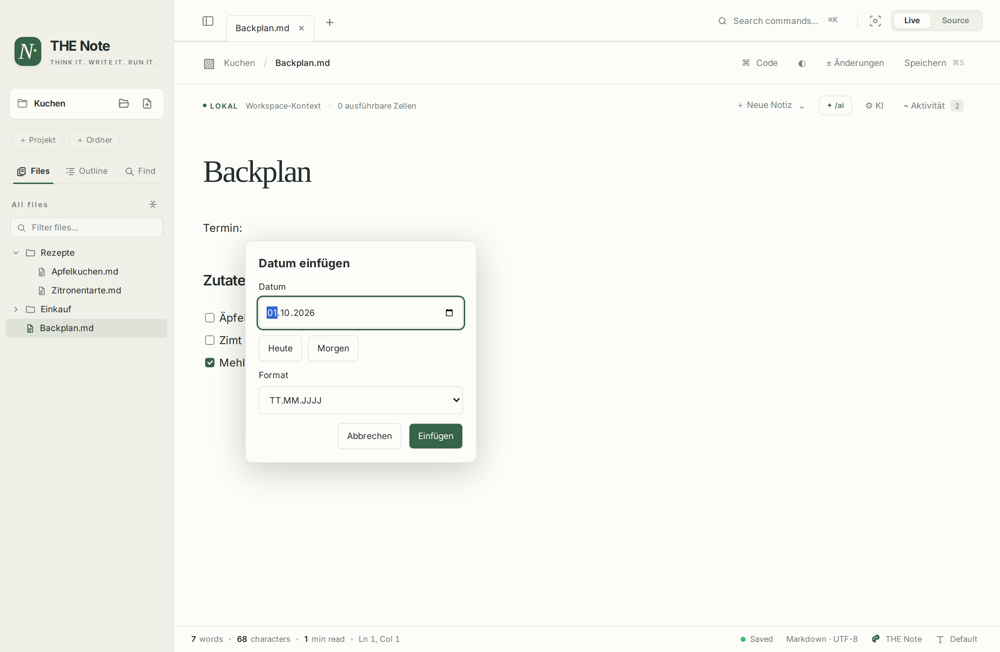
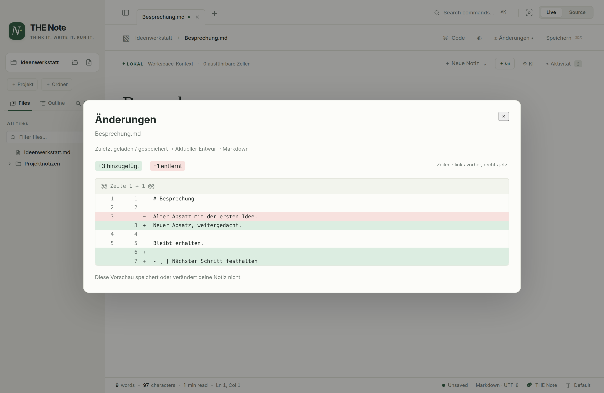
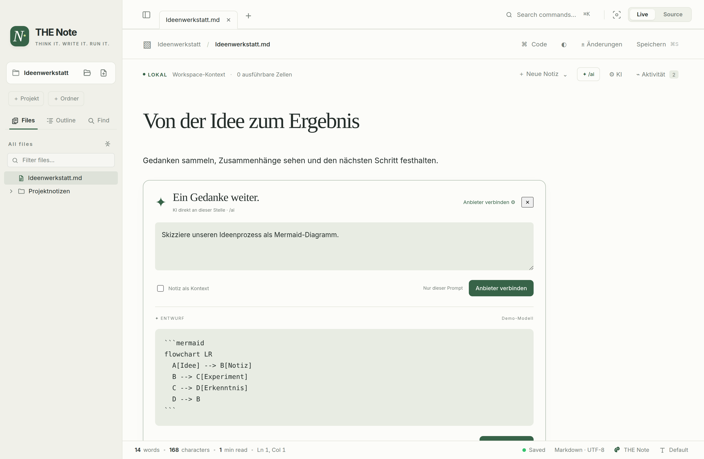
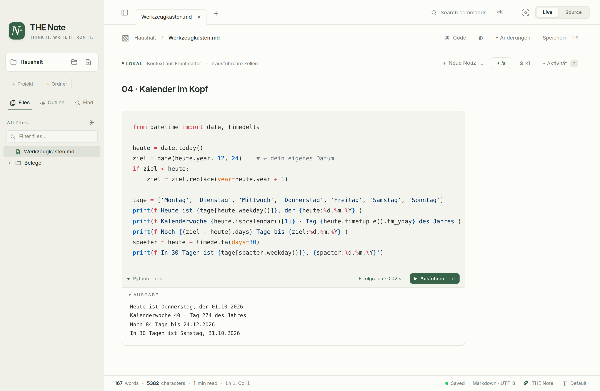
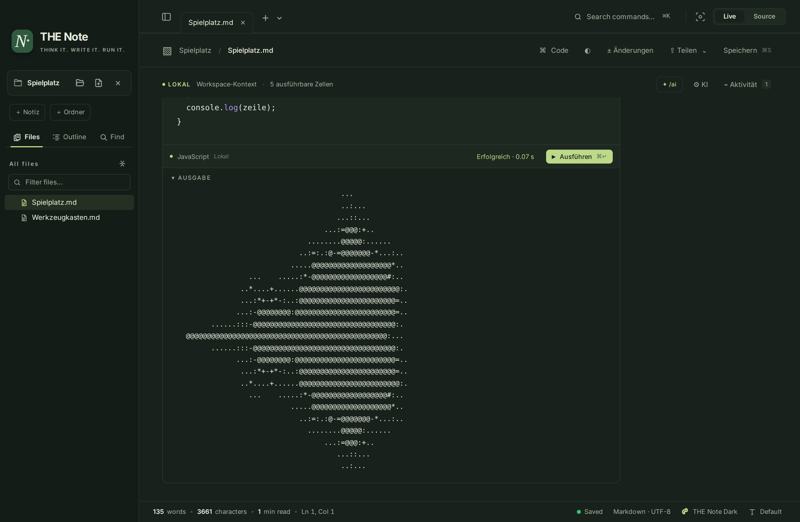

# THE Note

[Deutsch](README.md) · **English**



A local notebook for thoughts, plans and projects. You write in Markdown, organise notes in projects and folders, and when a note needs to calculate, check or try something, its code block runs right inside it.

THE Note combines **Sarala's live Markdown editor** with **Ledge's executable notes**. A native macOS app built on Tauri 2 and SolidJS. Current state: **0.2.7, a functional development version**.

> The app interface and the bundled example notes are currently in German. Markdown files, code blocks and everything you write are, of course, in whatever language you like.

## Website and installation

[**Discover THE Note, try it in your browser and install it →**](https://tobwil.github.io/THENote/en/) · [Download v0.2.7](https://github.com/tobwil/THENote/releases/tag/v0.2.7) · [Changelog](CHANGELOG.md)

Currently for **macOS 11+ on Apple Silicon**. Three ways lead to the same app:

### Homebrew

```sh
brew tap tobwil/thenote https://github.com/tobwil/THENote
brew trust --cask tobwil/thenote/the-note
brew install --cask tobwil/thenote/the-note
```

The tap lives in this repository. `brew trust` is required from Homebrew 6 on; skip that line on older versions. Updates: `brew update` and `brew upgrade --cask tobwil/thenote/the-note`.

### Terminal with curl

```sh
curl -fsSL https://tobwil.github.io/THENote/install.sh | bash
```

Installs into `~/Applications` without `sudo`. The installer verifies the SHA-256, app signature, identifier and version. An existing app is only replaced with `--replace`, and a backup is kept. To only download and verify:

```sh
curl -fsSL https://tobwil.github.io/THENote/install.sh | bash -s -- --check
```

### Download the DMG

Open the [DMG for macOS Apple Silicon](https://github.com/tobwil/THENote/releases/download/v0.2.7/THE.Note-macOS-arm64.dmg) and drag **THE Note.app** to **Applications**. Eject the disk image, then open the app from Applications.

Alternatively: [download the ZIP](https://github.com/tobwil/THENote/releases/download/v0.2.7/THE.Note-macOS-arm64.zip).

Save open notes and quit the app before updating. This preview is **Developer ID signed and notarised by Apple**. macOS may show its standard confirmation when you first open an app downloaded from the internet. None of the install methods change security settings. Windows, Linux and Intel Mac packages are not verified yet.

Node.js and Python are only needed for their respective code blocks; the editor itself runs on its own. [Installation details, updates and removal](docs/INSTALLATION.md) (German) · [Licence and origin](LICENSING.md).

## Thank you, Sarala and Ledge

THE Note builds on **[Sarala](https://github.com/solancer/sarala)** by **Srinivas Gowda** and on the concept of executable notes from **[Ledge](https://github.com/ledgesh/ledge)**. Sarala provides the editor foundation; Ledge also contributed the frontmatter parser. Both projects are real foundations of this work. The new local Rust runner and the THE Note extensions are documented here.

The project as a whole is **GPL-3.0-or-later**. The Ledge parser keeps **Apache-2.0**. Original texts, reference commits and changes are listed in [NOTICE.md](NOTICE.md) and [LICENSING.md](LICENSING.md).

## A look inside

### A note that does the maths

Ideas, a checklist and open questions come first; a small code block works out the costs on the side. The output appears below the block and is never written into the file. Here in the dark theme **THE Note Dark**, above in the light one.



### Projects, nested notes and inline dates



### Changes before saving



### AI right inside the document



The screenshots show example and test notes. All code output was produced locally with `bash`, `python3` and `node`; the AI answer is a reproducible demo, no external provider was contacted. Regenerate them with `node scripts/screenshots.mjs`.

## What was merged

- **Writing:** live Markdown, source mode, tabs with their own undo, outline, search, tables, maths, Mermaid/D2, focus mode and Sarala's existing export features.
- **Tables that calculate:** `/formel` (or `/formula`, `/excel`) inserts a table with formulas such as `=SUM(D2:D4)`. The file keeps the formula, the note shows the result; see [Tables with formulas](#tables-with-formulas).
- **Zoom into diagrams:** hovering a Mermaid or D2 diagram shows **⤢ Vergrößern** (enlarge). The full-window view zooms with pinch or ⌘/Ctrl + scroll, pans by dragging or scrolling and knows `+`, `−`, `0` (fit), `1` (100 %) and Esc. Also in the command palette: "Diagramm vergrößern".
- **Paste images:** paste screenshots, copied images and image files copied in Finder with ⌘/Ctrl + V. The image is saved next to the note in `assets/` (or the folder from `copy-images-to` in the front matter) and linked relatively. Text from Excel or Word stays text.
- **Folders for your notes:** all notes are .md files in one notes folder. **＋ Notiz** (note) and **＋ Ordner** (folder) work right away: with no folder open, THE Note sets up *Documents/THE Note*; or open your own folder with the folder icon. Group notes in sub folders (e.g. recipes, meeting minutes): **drag** a note onto a folder or right-click → **In Ordner verschieben …** (move to folder); open tabs follow. Right-click a folder → **Neue Notiz hier …** (new note here) or **Unterordner erstellen …** (create sub folder). The folder stays open across restarts; **×** in the sidebar header closes it again without touching the files. Empty folders stay visible.
- **Tab names:** double-click, right-click or F2 on a tab opens **Datei umbenennen** (rename file). Saved files are renamed in place; unsaved notes get a name for their first save. Text and undo are preserved.
- **Dates:** `/date` or `/datum` opens a date picker at the caret with today/tomorrow and German or ISO format. The result stays plain Markdown text.
- **Changes before saving:** **± Änderungen** compares the current Markdown draft with the last loaded/saved state. Additions and deletions with line numbers, per tab; new notes are compared with an empty document. Line endings and the editor's normalisation mean this is not a byte diff.
- **Execution:** Shell, Bash, Zsh, Python and JavaScript/Node right inside the code block; live output, exit code, duration, stop and an activity log.
- **Context:** Ledge's frontmatter parser provides `cwd`, `env` and `confirm`. Relative working directories resolve against the open workspace, otherwise the note's folder, otherwise the home directory.
- **Interface:** THE Note's own light design and **THE Note Dark** (forest green with lime); on first launch the app follows the system appearance, after that your choice via **◐** applies. Templates for a journal, a runbook, diagrams plus the playground and toolbox. Some inherited editor menus are in English, the rest of the interface is German.
- **Optional AI assistant:** **/ai right in the document**, OpenAI/Claude/Gemini/internal APIs with fetched model lists, your own API key, macOS keychain, streaming and deliberately shared document context. Setup: [docs/AI-PLUGIN.md](docs/AI-PLUGIN.md).
- **Own identity:** app ID, settings, icon and package name are separate from Sarala. The upstream update channel is disabled.

The architecture decisions and differences are described in [docs/REENGINEERING.md](docs/REENGINEERING.md). Origin and licences: [NOTICE.md](NOTICE.md).

## Tables with formulas

A cell that starts with `=` is a formula. The Markdown keeps the formula, the note shows the result, and the formula appears as a tooltip. Click into the table to see and edit the formulas, like in a spreadsheet. Insert one with **/formel** (or `/formula`) in the text, the command palette (⌘K) or **Paragraph ▸ Table ▸ Tabelle mit Formeln**.

```markdown
| Item | Qty | Price | Sum |
| :--- | ---: | ---: | ---: |
| Coffee | 2 | 3.50 € | =B2*C2 |
| Cake | 3 | 2.80 € | =B3*C3 |
| **Total** | =SUM(B:B) | | **=SUM(D:D)** |
```

- **Spreadsheet addresses:** columns A, B, C …; the header is row 1, the first body row is row 2. Ranges like `B2:B5` or whole columns like `D:D`. When the formula itself sits in that column, only the rows above it count, so a total row stays right as rows are added.
- **Arithmetic:** `+ - * / ^`, parentheses, percent (`20%`), comparisons (`= <> < > <= >=`), text in `"…"` and `&` to join.
- **Functions**, in English or German: `SUM`/`SUMME`, `AVERAGE`/`MITTELWERT`, `MIN`, `MAX`, `COUNT`/`ANZAHL`, `COUNTA`/`ANZAHL2`, `PRODUCT`/`PRODUKT`, `ROUND`/`RUNDEN`, `ABS`, `IF`/`WENN`. Separate arguments with `;` or `,`; decimals in formulas use a dot.
- **Numbers in cells** may be written in German or English style (`1.234,50 €`, `3.5`) and carry a currency; results keep the currency and are shown in German number format, matching the app's interface.
- **Errors** read like spreadsheet errors: `#DIV/0!`, `#WERT!` (value), `#BEZUG!` (reference), `#NAME?`, `#ZYKLUS!` (cycle). The cell's tooltip explains what is wrong (in German).

## Running code blocks in notes

Open a folder, create a document via **Neue Notiz → Ausführbares Runbook** (new note → executable runbook) and save it as `.md`. A minimal example:

````markdown
---
cwd: .
confirm: true
env:
  PROJECT: THE-Note
---

# My runbook

```sh
printf 'Project: %s\n' "$PROJECT"
pwd
```

```python
print(sum([12, 18, 24, 30]) / 4)
```
````

**Ausführen** (run) starts a block; **⌘/Ctrl+Enter** starts the code block you are editing. `confirm: true` asks for confirmation before each start; per block, `confirm`, `confirm=yes` and `confirm=no` are available. Without a confirmation option only an explicit click or shortcut starts code, never opening a file.

Output is temporary and never written into the Markdown file. It survives switching tabs. Each run has a 120-second time limit and a 1 MB output limit; at most eight processes run at once. On macOS/Linux, stop also ends the process group.

**Code runs with the permissions of your user account.** Process isolation is not a security sandbox. Only run code you trust.

## Example notes

The [`examples/`](examples/) folder holds notes to try out (in German for now). Every code block in them **only reads** and changes nothing; numbers and strings can be edited right away.

- **[Lissabon im Mai](examples/Reiseplanung.md)** (Lisbon in May): an ordinary planning note with a small cost calculation, the note from the screenshots.
- **[Werkzeugkasten](examples/Werkzeugkasten.md)** (toolbox, also under **＋ Neue Notiz**): check installed runtimes, summarise a folder by file type, Git at a glance, calendar week and days until a date, evaluate spending from CSV, validate JSON, generate a passphrase and a UUID.
- **[Spielplatz](examples/Spielplatz.md)** (playground, also under **＋ Neue Notiz**): 🚀 a countdown with live output, 🎲 a dice oracle, ✦ a Sierpinski triangle from `x & y`, 🌀 Mandelbrot in characters and 🐟 an aquarium that runs for a minute and can be halted with **■ Stoppen** (stop).

| Toolbox, light | Playground, dark |
| :--- | :--- |
|  |  |

No app installed yet? Try THE Note [on the website](https://tobwil.github.io/THENote/en/#try) in a recreated window: click a paragraph and edit its Markdown, tick off tasks, switch notes and run the small cost calculation.

## Deliberate limits of this version

Every start is its own process: `cd`, variables and virtual environments from one block do not carry over to the next; use `cwd`/`env` in the frontmatter instead. Interactive input and a PTY terminal are still missing. SSH, servers/mobile devices, SQL/Redis, prompt agents, MCP, encrypted backups and secret profiles are not integrated yet. Notes with remote hosts, `profile` or `envFile` are explicitly rejected when run, instead of starting in a wrong local context.

In the browser only the editor with Markdown download is available. File dialogs, workspace file access and process execution are features of the desktop app. The activity log lasts for the session. HTML export keeps Sarala's existing export style; the new app interface is not an identical print style. Other export formats need Pandoc, PDF uses the existing Chromium export path.

## Development

Requirements: Node.js 22.12+ (Node 24+ recommended), npm, stable Rust and the Tauri build prerequisites; on macOS the Xcode Command Line Tools.

```sh
npm ci
npm run dev             # Browser editor at http://localhost:1420
npm run desktop         # Native app in development mode
npm run package:macos    # Sign and verify the preview; create ZIP + DMG
```

The packaging command places ZIP and DMG under `release/`. For Apple-notarised packages, use `npm run package:macos -- --notarized`; setup: [SIGNING.md](docs/SIGNING.md) (German). `THE_NOTE_RELEASE_DIR=release/v0.2.7` picks a separate target folder. Build output does not belong in source commits.

The website lives in `site/`: one HTML template, texts per language in `site/i18n.mjs`. `npm run build:site` renders German to `/` and English to `/en/`.

## Checks

```sh
npm run typecheck
npm run lint
npm test
npm run test:notebook
npm run test:ai:ui      # UI with simulated native IPC; HTTP tests in Rust
npm run test:diff:ui
npm run test:workspace:ui
npm run test:site       # Website DE/EN, live cell, install tabs and mobile layout
cargo test --manifest-path src-tauri/Cargo.toml
```

`test:notebook` starts its own local server and uses Playwright Chromium or the installed Google Chrome. The other inherited `test:e2e` scripts remain as editor regression tests; they expect an installed Playwright browser. New UI and runtime contracts are covered in `tests/e2e-notebook.mjs`, `tests/execution.test.mjs` and `src-tauri/src/execution.rs`.

## Licence

GPL-3.0-or-later. Sarala © Srinivas Gowda. The adopted Ledge frontmatter parser keeps Apache-2.0; licence texts and origin are documented in [NOTICE.md](NOTICE.md). This is an independent derivative project.

## History and contributing

- [Conversation archive with timestamps and attachments](docs/history/README.md) (German)
- [Changelog](CHANGELOG.md), [architecture decisions](docs/REENGINEERING.md), [validation results and limits](docs/VALIDATION-v0.2.7.md)
- [Contributing and local development](CONTRIBUTING.md)
- [Third-party notices](THIRD_PARTY_NOTICES.md)

The early versions were developed before the first source push. The conversation archive documents that development; it does not replace a retroactively invented Git history.
