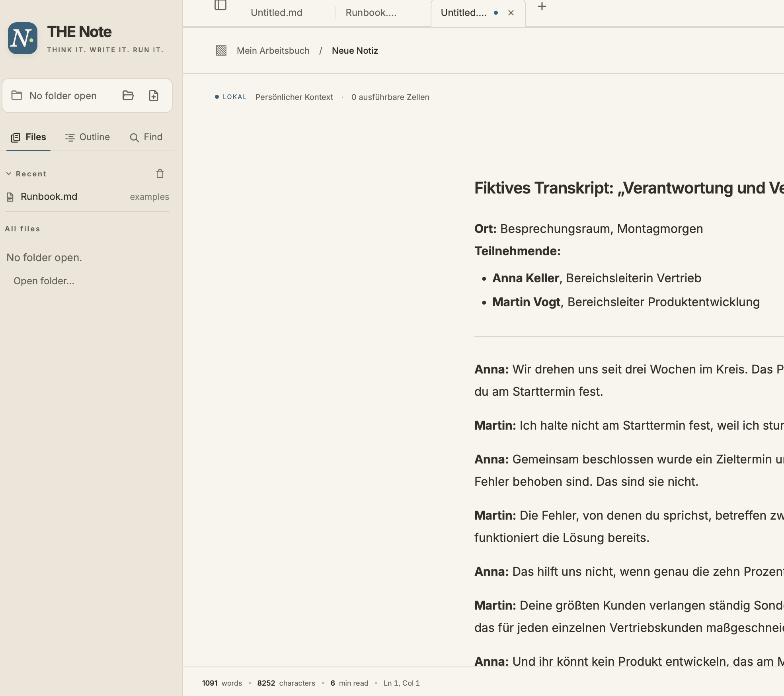
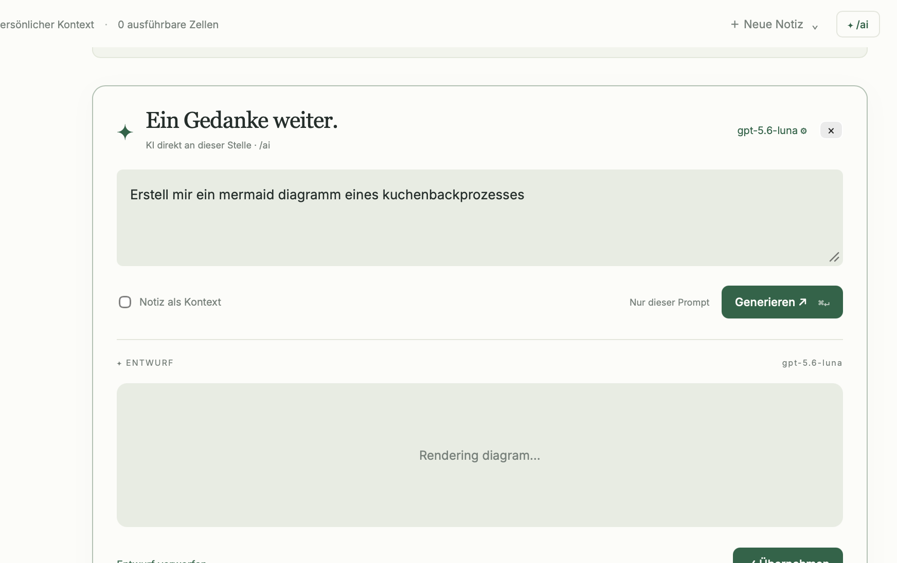

# Gesprächsverlauf · THE Note

Exportiert: 2026-10-01T15:30:04.702262+00:00. Zeiten unten: Europe/Berlin.

Vollständiger sichtbarer Nutzer-/Assistenten-Dialog bis zum Exportzeitpunkt, einschließlich Zwischenständen. Lokale Benutzerpfade wurden neutralisiert; automatisch eingefügte Umgebungsdaten sowie interne System-, Werkzeug- und Denkprotokolle sind nicht enthalten. Die beiden Nutzer-Anhänge liegen unverändert unter `attachments/`. Historische Aussagen beschreiben ihren damaligen Stand; der aktuelle Funktionsumfang steht in README und Changelog.

## 001 · Nutzer · 2026-10-01 13:37:13 CEST · Nachricht

ich möchte das du die beiden lösungen reengineerst und zu einer geilen machst! [https://github.com/solancer/sarala](https://github.com/solancer/sarala) + [https://github.com/ledgesh/ledge](https://github.com/ledgesh/ledge)

## 002 · Assistent · 2026-10-01 13:37:16 CEST · Zwischenstand

Ich schaue mir beide Projekte und deinen Workspace an, arbeite ihre Stärken heraus und baue daraus eine gemeinsame Lösung. Dabei prüfe ich auch, welche Architektur und Lizenzen die Zusammenführung ermöglichen.

## 003 · Assistent · 2026-10-01 13:38:03 CEST · Zwischenstand

Die Kombination passt gut: Sarala liefert den Markdown-Editor mit Live-Blöcken, Ledge macht Notizen zu ausführbaren Arbeitsbüchern. Ich nutze Saralas Editor als Basis und integriere Codeausführung, Ausgaben und Workspace-Kontext in eine gemeinsame Oberfläche namens „THE Note“. Beide Desktop-Laufzeiten parallel zu übernehmen würde unnötige Komplexität schaffen.

## 004 · Assistent · 2026-10-01 13:39:41 CEST · Zwischenstand

Ich baue jetzt den ersten durchgängigen Stand: Markdown schreiben, Shell-/Python-/JavaScript-Blöcke direkt starten, Ausgaben live sehen und Prozesse stoppen. Die App bleibt dateibasiert; `cwd` und `env` in der Notiz bestimmen den Ausführungskontext. Ledges SSH-, Mobil- und Serverfunktionen bleiben zunächst außerhalb dieses lokalen Kerns.

## 005 · Assistent · 2026-10-01 13:47:00 CEST · Zwischenstand

Der Editor und die Ausführungsoberfläche sind verbunden: Codeblöcke haben jetzt Start/Stop und einen Ausgabebereich; dazu kommen Vorlagen für Gedankenbuch, Runbook und Diagramme. Ich prüfe gerade den nativen Unterbau, insbesondere Prozessabbrüche, Fehlerausgaben und den Ausführungskontext. Außerdem ist Saralas Updatekanal deaktiviert, damit er die neue App nicht durch das Original ersetzen kann.

## 006 · Assistent · 2026-10-01 13:51:36 CEST · Zwischenstand

Die bisherigen Prüfungen sind grün: die übernommenen Editor-Tests, zwölf neue Tests für Codeblöcke und Notizkontext sowie fünf native Tests für Ausgabe, Abbruch und Zeitlimits. Auch der komplette Browser-Ablauf funktioniert. Beim macOS-Paket gab es einen Versionskonflikt zwischen zwei Tauri-Komponenten; der ist korrigiert, und ich baue jetzt die startbare App.

## 007 · Assistent · 2026-10-01 13:57:13 CEST · Zwischenstand

Das macOS-Paket ist gebaut. Ich habe außerdem einen sichtbaren Sprung beim Wechsel von Überschrift zu Bearbeitung gefunden und korrigiert. Als letzten Schritt prüfe ich jetzt die eigenständige App mit echter Python-/Shell-Ausführung und lege dir anschließend das startbare Paket samt Quellcode und Architekturbericht bereit.

## 008 · Assistent · 2026-10-01 14:01:03 CEST · Zwischenstand

Die App und die Tests sind fertig gebaut. Die direkte Kontrolle des nativen Fensters wartet derzeit auf die macOS-Freigaben für Computer Use. Unabhängig davon sind die echten Prozess-Tests und die Browser-Prüfungen erfolgreich; ich bereite währenddessen das Paket und die Startanleitung vor.

## 009 · Assistent · 2026-10-01 14:04:52 CEST · Zwischenstand

Die native App hat jetzt auch echte Python-, Shell- und JavaScript-Blöcke erfolgreich ausgeführt. Arbeitsverzeichnis und Umgebungsvariable aus der Notiz kommen korrekt im Prozess an. Dabei habe ich noch zwei Integrationsdetails bereinigt: Frontmatter erscheint nicht mehr fälschlich in der Gliederung, und Bestätigungsdialoge tragen den neuen App-Namen.

## 010 · Assistent · 2026-10-01 14:07:58 CEST · Antwort

**THE Note v0.1 ist gebaut und geöffnet.**

- Saralas Live-Markdown-Editor mit eigenem Design, Tabs, Diagrammen und Fokusmodus.
- Ledge-inspirierte Codezellen für Python, Shell und JavaScript – mit Live-Ausgabe, Stop und Notizkontext.
- Automatisierte Tests bestanden; alle drei Sprachen auch nativ geprüft.

[macOS-App herunterladen](<<WORKSPACE>/release/THE Note-macOS-arm64.zip>) · [Anleitung](<<WORKSPACE>/README.md>) · [Architekturbericht](<<WORKSPACE>/docs/REENGINEERING.md>)

Lokaler Entwicklungsbuild für Apple Silicon. SSH, Mobilgeräte, MCP und persistente Shell-Sessions sind noch nicht integriert.

## 011 · Nutzer · 2026-10-01 14:07:59 CEST · Nachricht

wie wäre es jetzt noch mit einem optionalen ki api key, dass ich z.b. ein internes lugin aktivieren kann und im dokument auch einen chat öffne o.ä.?

## 012 · Assistent · 2026-10-01 14:08:04 CEST · Zwischenstand

Ja — ich ergänze ein optionales KI-Modul mit eigener API-Konfiguration und einem Chat direkt neben der Notiz. Dokumentinhalt wird nur dann mitgeschickt, wenn du ihn ausdrücklich als Kontext auswählst.

## 013 · Assistent · 2026-10-01 14:08:25 CEST · Zwischenstand

Ich setze das als eingebautes, abschaltbares „KI-Assistent“-Plugin um: Anbieter und Modell einstellen, API-Key hinterlegen, Chat öffnen und Antworten bei Bedarf in die Notiz übernehmen. Für die OpenAI-Anbindung nutze ich die OpenAI-Docs-Skill; zusätzlich plane ich eine konfigurierbare Schnittstelle für interne oder lokale, OpenAI-kompatible Dienste.

## 014 · Assistent · 2026-10-01 14:12:45 CEST · Zwischenstand

Die Anbindung läuft im nativen Backend. Der Key landet weder in der Markdown-Datei noch im Browser-Speicher; auf macOS kannst du ihn optional im Schlüsselbund behalten. Der Chat bekommt einen eigenen Verlauf pro Notiz, gestreamte Antworten und eine Stop-Taste. Änderungen an der Notiz erfolgen erst über „In Notiz übernehmen“.

## 015 · Nutzer · 2026-10-01 14:12:57 CEST · Nachricht

Frage: Welchen KI-Dienst möchtest du hauptsächlich anschließen? Bitte hier keinen API-Key eingeben – dafür bekommt die App ein eigenes Feld.

Antwort: Interne/OpenAI-kompatible API

## 016 · Assistent · 2026-10-01 14:13:02 CEST · Zwischenstand

Passt — die interne, OpenAI-kompatible API wird der Standard. Du trägst die vollständige Endpoint-URL, die Modell-ID und bei Bedarf einen Bearer-API-Key ein; die Anfrage geht direkt an euren Dienst.

## 017 · Assistent · 2026-10-01 14:20:45 CEST · Zwischenstand

Die interne, OpenAI-kompatible API ist als Standard vorgesehen. Ich prüfe jetzt Streaming, Abbruch und die Freigabe des Dokumentinhalts und baue danach die aktualisierte macOS-App.

## 018 · Assistent · 2026-10-01 14:23:53 CEST · Zwischenstand

Die Grundprüfungen decken jetzt auch die Datengrenzen ab: Ohne gesetzte Kontext-Option wird kein Dokument mitgeschickt. Bei einem Wechsel von Endpoint oder Modell verlangt die App einen neuen Chat, damit der bisherige Verlauf nicht versehentlich weitergegeben wird.

## 019 · Assistent · 2026-10-01 14:28:52 CEST · Zwischenstand

Die Tests für beide API-Protokolle und die Chat-Oberfläche sind erfolgreich: Streaming, Unicode, Fehlerfälle, Stoppen, getrennte Verläufe und das Übernehmen in die Notiz funktionieren im Test. Als Nächstes prüfe ich die gebaute Desktop-App gegen einen lokalen Testdienst.

## 020 · Assistent · 2026-10-01 14:31:16 CEST · Zwischenstand

Auch die bisherigen Editor- und Runbook-Tests sind weiterhin grün. Das Release-Paket wird gerade gebaut. Für deine interne API brauchst du anschließend nur die vollständige Endpoint-URL, die Modell-ID und gegebenenfalls den Key im Einstellungsdialog.

## 021 · Nutzer · 2026-10-01 14:33:21 CEST · Nachricht

1. naja, wir sollten schon einfach auch chatgpt oder claude oder gemini verbinden können, oder? also auch das deren richtige modelle geladen bzw. vorgeschlagen werden?
2. und anstelle einfach eines chatfensters daneben, was ja jeder schon hat, dachte ich eher an sowas dass ich /ai eingebe und dann dort direkt einen prompt eingeben kann und auf das ergebnis warte. quasi inline und nicht seperat. macht das sinn?

## 022 · Assistent · 2026-10-01 14:33:48 CEST · Zwischenstand

Ja, das macht Sinn. `/ai` passt deutlich besser zum Arbeitsbuch: direkt im Dokument einen Prompt schreiben, die Antwort dort streamen lassen und anschließend übernehmen oder verwerfen.

Ich passe die Umsetzung entsprechend an. Dazu kommen OpenAI, Claude und Gemini als direkte Anbieter mit einer Modellliste aus der jeweiligen API; die interne, OpenAI-kompatible Verbindung bleibt erhalten. Gemeint ist dabei der API-Zugang des Anbieters – ein Chat-Abonnement allein ersetzt keinen API-Key.

## 023 · Assistent · 2026-10-01 14:55:35 CEST · Zwischenstand

Der neue Ablauf wird: `/ai` → Prompt direkt im Dokument → „Generieren“ → gestreamter Entwurf an derselben Stelle. Mit „Übernehmen“ ersetzt du den KI-Block durch normalen Markdown-Text.

In den Einstellungen wählst du den Anbieter und lädst dessen verfügbare Textmodelle mit deinem Key. Eine manuelle Modell-ID bleibt für interne Gateways möglich, falls diese keine Modellliste anbieten.

## 024 · Assistent · 2026-10-01 15:19:31 CEST · Zwischenstand

`/ai` funktioniert jetzt im Editor, einschließlich Streaming, Abbruch, Verwerfen und Übernehmen mit Undo. Die Oberfläche lädt Modelllisten für alle drei Anbieter; die Protokolltests prüfen auch die unterschiedlichen Authentifizierungs-Header und Antwortformate.

Die Listen kommen vom jeweiligen Dienst. So muss die App keine fest einprogrammierten Modellnamen aktuell halten.

## 025 · Assistent · 2026-10-01 15:24:18 CEST · Zwischenstand

Der seitliche Chat ist aus dem Hauptablauf entfernt. Fertige Entwürfe erscheinen formatiert im KI-Block; beim Übernehmen werden sie zu normalem Markdown. Die Inline- und Notebook-Tests sind grün. Ich prüfe noch das macOS-Paket mit einem lokalen Testdienst – echte Anbieteraufrufe kann ich ohne deine API-Keys nicht verifizieren.

## 026 · Assistent · 2026-10-01 15:27:27 CEST · Zwischenstand

Die native App lädt die Modellliste bereits korrekt. Beim Testen der Schlüsselablage ist noch ein Unterschied zwischen Browser- und macOS-Eingabe aufgefallen. Ich prüfe das direkt im Passwortfeld, bevor ich das Paket abschließend freigebe.

## 027 · Assistent · 2026-10-01 15:29:36 CEST · Zwischenstand

Die native Prüfung ist erfolgreich: Modellliste geladen, Test-Key im macOS-Schlüsselbund gespeichert und nach einem App-Neustart wieder verwendet. Die Antwort wurde direkt im Dokument gestreamt. Ich prüfe noch Kontextfreigabe und Abbruch und entferne danach die Testverbindung.

## 028 · Assistent · 2026-10-01 15:34:11 CEST · Antwort

Ja – so ist es jetzt umgesetzt:

1. **OpenAI, Claude, Gemini und interne APIs:** Anbieter auswählen, API-Key eintragen, **„Modelle laden“** klicken und ein tatsächlich verfügbares Modell wählen.
2. **Inline mit `/ai`:** Prompt direkt im Dokument schreiben → Antwort erscheint dort → **Übernehmen oder Verwerfen**. Übernehmen erzeugt normalen Markdown und lässt sich rückgängig machen.

Dokumentkontext bleibt optional. Schlüsselbund, Streaming und Abbruch wurden auch in der nativen App geprüft. Echte Anbieterzugänge bleiben ohne deine Keys ungetestet.

[macOS-App als ZIP](<<WORKSPACE>/release/THE Note-macOS-arm64.zip>) · [Einrichtung](<<WORKSPACE>/docs/AI-PLUGIN.md>) · [Inline-Vorschau](<<WORKSPACE>/release/THE Note-ai-preview.png>)

## 029 · Nutzer · 2026-10-01 15:42:03 CEST · Nachricht

1. warum ist hier sovile platz neben dem text? links
2. fokus auf texteingabe bei /ai (nur wenn ich es manuell eingebe. beim klick auf das icon gehts) geht manchmal nicht, sodass ich immer wieder aktiv reinklicken muss
3. was sind noch sinnvolle / befehle? summarize? format?

## 030 · Assistent · 2026-10-01 15:42:09 CEST · Zwischenstand

Ich prüfe den großen linken Abstand und behebe den Fokus beim manuell eingegebenen `/ai`. Für weitere Befehle wären `/summarize`, `/rewrite`, `/format` und `/tasks` sinnvoll: Sie könnten einen passenden Prompt vorbereiten, den du vor dem Start noch anpassen kannst.

## 031 · Assistent · 2026-10-01 15:50:49 CEST · Zwischenstand

Der linke Abstand kommt von einer auf 870 Pixel begrenzten, zentrierten Schreibfläche. Auf breiten Fenstern wächst dadurch der linke Leerraum stark. Ich richte die Schreibfläche links aus und behalte die begrenzte Zeilenlänge bei.

Beim Fokus hängt der bisherige Code am Aktivzustand des Markdown-Blocks, der sich während der `/ai`-Umwandlung ändern kann. Ich gebe dem neu eingefügten KI-Feld deshalb einen eigenen Fokusauftrag.

## 032 · Assistent · 2026-10-01 15:56:31 CEST · Zwischenstand

Die Änderungen bestehen jetzt die Tests für `/ai` per Enter, Tab und Menüklick sowie für schmale und breite Fenster. Live- und Quelltextansicht beginnen mit einem kleinen linken Rand.

Ich packe das Update separat. Speichere vor dem Wechsel auf die neue App bitte deine offenen Notizen.

## 033 · Assistent · 2026-10-01 15:59:32 CEST · Antwort

1. **Linker Leerraum:** Die Schreibfläche war schmal begrenzt und zentriert. Jetzt beginnt sie links mit kleinem Abstand; die Zeilenlänge bleibt gut lesbar.

2. **Fokus bei `/ai`:** Die Fokusübergabe erfolgt jetzt ausdrücklich an das neue Promptfeld. Enter, Tab und Menüklick sind automatisiert getestet – direktes Weiterschreiben funktioniert.

3. Als nächste Befehle würde ich diese ergänzen, jeweils als anpassbaren Prompt:

| Befehl | Zweck |
|---|---|
| `/summarize` | Kernaussagen zusammenfassen |
| `/format` | Überschriften, Absätze und Listen strukturieren |
| `/rewrite` | Klarer oder kürzer formulieren |
| `/tasks` | Aufgaben, Verantwortliche und Termine herausziehen |
| `/translate` | In eine gewählte Sprache übersetzen |

Diese zusätzlichen Befehle sind **noch Vorschläge**.

[Update 0.2.1 herunterladen](<<WORKSPACE>/release/v0.2.1/THE Note-macOS-arm64.zip>). Vor dem Wechsel offene Notizen speichern und die bisherige App beenden.

## 034 · Nutzer · 2026-10-01 15:59:33 CEST · Nachricht

diff anzeigen, wenn noch nicht gespeichert?

## 035 · Assistent · 2026-10-01 15:59:41 CEST · Zwischenstand

Ja – ein Diff zwischen dem zuletzt gespeicherten Stand und deinen aktuellen Änderungen passt gut dazu. Ich baue eine Ansicht „Änderungen“ ein, die auch vor dem Speichern verfügbar ist.

## 036 · Assistent · 2026-10-01 16:01:52 CEST · Zwischenstand

Die Ansicht bekommt grüne Ergänzungen, rote Löschungen und Zeilennummern. Der Vergleichsstand bleibt pro Tab erhalten und wird erst nach erfolgreichem Speichern aktualisiert. Bei einer neuen Notiz erscheint der gesamte Inhalt als neu.

## 037 · Assistent · 2026-10-01 16:04:34 CEST · Zwischenstand

Der Diff ist eingebaut. Auch Tabwechsel, Undo und Änderungen während eines laufenden Speichervorgangs behalten den richtigen Vergleichsstand. Ich prüfe jetzt die Ansicht im Browser und baue anschließend das separate App-Update.

## 038 · Assistent · 2026-10-01 16:07:18 CEST · Zwischenstand

Die Prüfungen sind erfolgreich: Ein fehlgeschlagener Speichervorgang erhält den Diff, erfolgreiches Speichern setzt den Vergleichsstand neu, und Undo danach zeigt die Unterschiede zum gespeicherten Text. Das App-Paket wird gerade fertiggebaut.

## 039 · Assistent · 2026-10-01 16:08:38 CEST · Antwort

Ja – eingebaut. **„± Änderungen“** neben „Speichern“ zeigt den Diff zum zuletzt gespeicherten Stand:

- Grün: Ergänzungen
- Rot: Löschungen
- Zeilennummern und Kontext, pro Tab

Tests und Build erfolgreich. [App-Update 0.2.2](<<WORKSPACE>/release/v0.2.2/THE Note.app>)

Vor dem Wechsel offene Notizen speichern und die bisherige App schließen.

## 040 · Nutzer · 2026-10-01 16:26:50 CEST · Nachricht

1. umbennen der datei via des offenen tabs sollte möglich sein.
2. ich möchte "ordner" oder "porjket" erstellen können und unter diesend ann die notizen. 
3. inline auch datepicker oder so via slahs?
4. bei mermaid erstellen via ai versucht er das diagramm in der vorschau zu rendern. ich denke da reicht der text, oder?

## 041 · Assistent · 2026-10-01 16:26:55 CEST · Zwischenstand

Ich setze die vier Punkte um: Umbenennen direkt am Tab, Projekte und Unterordner mit Notizen, einen Datumspicker über `/date` und KI-Entwürfe als Markdown-Text. Mermaid wird dann erst nach „Übernehmen“ im Dokument gerendert.

## 042 · Assistent · 2026-10-01 16:30:22 CEST · Zwischenstand

Ein Projekt wird ein normaler Ordner auf deinem Mac; darin kannst du weitere Ordner und Markdown-Notizen anlegen. Leere Ordner bleiben in der Seitenleiste sichtbar. Am Tab ergänze ich Doppelklick, Rechtsklick und F2 zum Umbenennen – ungespeicherte Änderungen bleiben dabei erhalten.

## 043 · Assistent · 2026-10-01 16:41:04 CEST · Zwischenstand

Die neuen Bedienelemente sind eingebaut. `/date` öffnet einen Picker direkt an der Schreibstelle und fügt das Datum als normalen Text ein. KI-Entwürfe zeigen jetzt durchgehend den Markdown-Quelltext – auch Mermaid-Code. Als Nächstes prüfe ich die Abläufe und den Dateischutz beim Anlegen und Umbenennen.

## 044 · Assistent · 2026-10-01 16:44:49 CEST · Zwischenstand

Die neuen Abläufe bestehen die Tests: verschachtelte Ordner und Notizen, Umbenennen mit erhaltenem Text und Undo sowie Datumseinfügen und Abbrechen. Mermaid bleibt im KI-Entwurf Text und wird nach „Übernehmen“ gerendert. Ich baue jetzt Version 0.2.3 als separates Update.

## 045 · Assistent · 2026-10-01 16:46:40 CEST · Antwort

Alle vier Punkte sind in **0.2.3** umgesetzt:

1. **Tab umbenennen:** Doppelklick, Rechtsklick oder F2. Ungespeicherter Text bleibt erhalten.
2. **Projekte und Ordner:** „＋ Projekt“ und „＋ Ordner“ links. Rechtsklick auf einen Ordner → „Neue Notiz hier …“.
3. **Datum inline:** `/date` oder `/datum` öffnet den Picker, mit Heute/Morgen und Datumsformat.
4. **KI-Vorschau:** Zeigt Markdown-Text. Mermaid rendert erst nach „Übernehmen“.

Tests und Build erfolgreich. [App 0.2.3 öffnen](<<WORKSPACE>/release/v0.2.3/THE Note.app>)

Vor dem Wechsel offene Notizen speichern und die bisherige App schließen.

## 046 · Nutzer · 2026-10-01 16:46:40 CEST · Nachricht

ok, wenn alles passt bitte nach github pushen: [https://github.com/tobwil/THENote](https://github.com/tobwil/THENote) bitte auch die beiden initialen ideengeber tools sarala und ledge nennen und auch die lizenz so anpassen das beide benannt werden. möchte meins auch anbieten als open source. bitte auch screenshots beifügen und auch unsere komplette history mit abspeichern. also gesprächsverlauf changelog usw

## 047 · Assistent · 2026-10-01 16:46:51 CEST · Zwischenstand

Ich bereite das Repository für die Open-Source-Veröffentlichung vor: Herkunft und Lizenzen von Sarala und Ledge, Screenshots, Changelog und Gesprächsarchiv. Danach prüfe ich den Inhalt auf private Daten und Zugangsdaten und pushe ihn nach GitHub.

## 048 · Assistent · 2026-10-01 16:48:45 CEST · Zwischenstand

Das GitHub-Repository ist öffentlich und enthält bisher nur eine README. Ich behalte GPL-3.0-or-later für THE Note bei und ergänze beide Ursprungsprojekte deutlich in README und Lizenzhinweisen; Ledges übernommener Parser behält seinen Apache-2.0-Hinweis.

Den sichtbaren Gesprächsverlauf habe ich gefunden. Ich archiviere ihn mit Zeitstempeln und Anhängen; lokale Benutzerpfade werden neutralisiert, interne System- und Werkzeugprotokolle bleiben draußen.

## 049 · Assistent · 2026-10-01 16:53:47 CEST · Zwischenstand

README, Changelog, Gesprächsarchiv und die ersten Screenshots sind vorbereitet. Der Abgleich mit den dokumentierten Upstream-Commits bestätigt: Die GPL-/Apache-Lizenztexte sind unverändert, ebenso der übernommene Ledge-Parser. Ich ergänze noch die Abhängigkeitslizenzen und bereite den macOS-Download als GitHub-Prerelease vor.

## 050 · Assistent · 2026-10-01 17:06:13 CEST · Zwischenstand

Die Abschlussprüfung ist grün: Frontend-Prüfungen und alle 33 Rust-Tests bestehen. Im vorgesehenen Repository-Inhalt wurden keine privaten Benutzerpfade oder Zugangsdaten gefunden; das Download-ZIP enthält jetzt auch die Lizenztexte. Ich veröffentliche nun den Quellcode auf `main` und die App als Vorabversion `v0.2.3`.

## 051 · Assistent · 2026-10-01 17:08:12 CEST · Zwischenstand

Der Veröffentlichungs-Commit ist lokal fertig. Der Push hängt noch in der HTTPS-Verbindung zu GitHub. Ich prüfe den Remote-Stand und wiederhole ihn über die bereits angemeldete GitHub-CLI, ohne die bestehende Historie zu überschreiben.

## 052 · Assistent · 2026-10-01 17:11:35 CEST · Antwort

Veröffentlicht: **[tobwil/THENote](https://github.com/tobwil/THENote)** ✅

- Sarala und Ledge deutlich gewürdigt; GPL-3.0-or-later für THE Note, Apache-2.0 für den Ledge-Parser.
- Screenshots, Changelog und Lizenztexte enthalten.
- [Gesprächsarchiv](https://github.com/tobwil/THENote/tree/main/docs/history): 50 sichtbare Nachrichten bis zum Export, inklusive Anhängen; lokale Benutzerpfade neutralisiert.
- [macOS-Vorabversion 0.2.3](https://github.com/tobwil/THENote/releases/tag/v0.2.3) mit geprüfter Download-Prüfsumme.

Frontend-Prüfungen und alle 33 Rust-Tests erfolgreich.

## 053 · Nutzer · 2026-10-01 17:11:35 CEST · Nachricht

können wir es dann auch via curl oder brew usw anbieten? so wie auf der seite von sarala? das fände ich top! die info dann auch in die readme. oder können wir hier sogar eine github pages draus machen?

## 054 · Assistent · 2026-10-01 17:11:39 CEST · Zwischenstand

Ich ergänze einen Installationsweg per `curl` und Homebrew sowie eine GitHub-Pages-Seite mit Screenshots, Download und Installationsanleitung. Dafür prüfe ich zuerst Saralas Lösung und unser Release-Paket.

## 055 · Assistent · 2026-10-01 17:13:38 CEST · Zwischenstand

Sarala nutzt einen eigenen Homebrew-Tap im App-Repository. Das geht hier ebenfalls, ohne zusätzliches Repository. Ich biete zunächst unseren geprüften Build für Apple Silicon an; beide Installationswege prüfen die SHA-256-Prüfsumme. Die Pages-Seite bekommt eine eigene Download- und Installationssektion.

Die App bleibt vorerst nicht notarisiert. Ich weise darauf hin und lasse die macOS-Sicherheitsprüfung unverändert.

## 056 · Assistent · 2026-10-01 17:21:20 CEST · Zwischenstand

Der Installer prüft bereits das veröffentlichte ZIP erfolgreich – einschließlich Prüfsumme, Signatur und App-Version. Die Website enthält jetzt Screenshots und kopierbare Installationsbefehle. Ich teste noch die mobile Ansicht und die Homebrew-Definition, bevor ich Pages aktiviere.

## 057 · Assistent · 2026-10-01 17:24:47 CEST · Zwischenstand

Die Website funktioniert auf Desktop, Tablet und Smartphone; auch die kopierbaren Befehle und die Tastaturbedienung sind geprüft. Ich ergänze jetzt die Installations- und Update-Anleitung und veröffentliche die Seite über GitHub Pages.

## 058 · Assistent · 2026-10-01 17:27:44 CEST · Zwischenstand

GitHub Pages ist aktiviert. Der Installer weist beschädigte Downloads und ungültige Ziele ab; auch der Schutz der laufenden App funktioniert. Ich pushe jetzt Website, Homebrew-Cask, Anleitung und aktualisiertes Gesprächsarchiv und prüfe anschließend die öffentlichen Links.

## 059 · Assistent · 2026-10-01 17:29:10 CEST · Zwischenstand

Die Seite ist erfolgreich veröffentlicht. Auch der echte Homebrew-Test gegen GitHub ist durch: Tap einbinden, Cask laden und Download mit Prüfsumme prüfen funktioniert. Ich kontrolliere noch die live ausgelieferten Dateien; deine laufende App wurde dabei nicht verändert.

