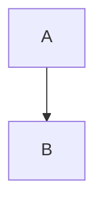

# Markdown rendering audit fixtures

Use each sample to compare inactive preview, clicking into it, editing, and exporting. Some examples intentionally exercise unsupported behavior.

## heading-h1

# Heading

## heading-h2

## Heading

## heading-h3

### Heading

## heading-h4

#### Heading

## heading-h5

##### Heading

## heading-h6

###### Heading

## setext-h1

Heading
=======

## setext-h2

Heading
-------

## closing-heading-hashes

## Heading ##

## strong

**Bold**

## emphasis

*Italic*

## nested-emphasis

**Bold and *italic***

## triple-emphasis

***Both***

## intraword-underscores

some_variable_name

## escaped-emphasis

\*literal\*

## html-entities

AT&amp;T &#169;

## strike

~~Old~~

## highlight

==Bright==

## subscript

H~2~O

## superscript

x^2^

## underline

<u>Underlined</u>

## underline-in-bold

**<u>Both</u>**

## code-single

`a < b`

## code-multi-backtick

``a ` b``

## code-multiline

`a
b`

## link-inline

[label](https://example.com)

## link-nested-parentheses

[label](https://example.com/a_(b))

## reference-link

[label][ref]

[ref]: https://example.com

## reference-image

![alt][ref]

[ref]: image.png

## angle-autolink

<https://example.com>

## bare-autolink

https://example.com

## image-inline

Text 

## soft-break

First
second

## hard-break-spaces

First  
second

## hard-break-backslash

First\
second

## horizontal-rule

***

## unordered-list

- A
- B

## ordered-start

7. A
8. B

## loose-list

- A

- B

## nested-list

- A
  - B

## tasks

- [ ] A
- [x] B

## quote

> A
>
> B

## nested-quote

> A
> > B

## alert-note

> [!NOTE]
> Body

## alert-tip

> [!TIP]
> Body

## alert-important

> [!IMPORTANT]
> Body

## alert-warning

> [!WARNING]
> Body

## alert-caution

> [!CAUTION]
> Body

## table-basic

| A | B |
| --- | --- |
| 1 | 2 |

## table-optional-pipes

A | B
--- | ---
1 | 2

## table-escaped-pipe

| A | B |
| --- | --- |
| a\|b | c |

## fenced-code

```js
const a = 1;
```

## long-fence-with-short-inner

````md
```

text
````

## indented-code

    first

    second

## inline-math

Value $x^2$ here

## display-math

$$
x^2
$$

## math-blank-line

$$
x + y

+ z
$$

## math-chemistry

$\ce{H2O}$

## math-physics

$\qty(x)$

## math-reference

$\ref{eq1}$

## mermaid



## d2

```d2
a -> b
```

## legacy-sequence

```sequence
A->B: hello
```

## legacy-flow

```flow
a=>start: Start
a->a
```

## emoji

:smile:

## footnote-document

Text[^note].

[^note]: A footnote

## footnote-multiline

[^note]: First

    Second

## repeated-footnote-reference

First[^n] second[^n]

## frontmatter

---
title: Hello
---

## toc-upper

[TOC]

## toc-lower

[toc]

## duplicate-heading-ids

# Repeat

# Repeat

## html-kbd

Press <kbd>Enter</kbd>

## html-ruby

<ruby>漢<rt>kan</rt></ruby>

## html-details

<details>
<summary>More</summary>

Text

</details>

## html-video

<video controls src="movie.mp4"></video>

## html-audio

<audio controls src="sound.mp3"></audio>

## html-iframe

<iframe src="https://example.com"></iframe>

## html-comment

Before <!-- hidden --> after

## html-br

First<br>Second

## html-span-style

<span style="color:red">Red</span>

## nested-quote-in-alert

> [!NOTE]
> Intro
>
> > Quoted
>
> After

## inline-image-title


## link-title

[Label](https://example.com "Title")

## escaped-html

&lt;script&gt;

## unsafe-script-filtered

<script>alert(1)</script>

Safe

## toc-inside-document

# Example

[TOC]

Text

## preserve-line-breaks-option

First
second

## alternate-inline-math-option

Value \(x+1\) here

## math-fence-option

```math
x+1
```
