# Apache Kafka, End to End

A field guide to Apache Kafka: the log abstraction, brokers and the controller, producers and consumers, delivery guarantees, operations, and the ecosystem around it. This document doubles as a **rendering stress test** for Sarala, so it deliberately mixes every construct the editor supports: tables, diagrams, math, code in many languages, callouts, footnotes, task lists, and raw HTML.

[TOC]

> [!NOTE]
> Version numbers refer to Kafka 3.x with KRaft (ZooKeeper-less) mode unless a section says otherwise. Where ZooKeeper behaviour differs, it is called out explicitly.

## 1. Why Kafka exists

Before Kafka, most organisations wired systems together point to point. Every new consumer of data meant another integration, another batch export, another fragile cron job. With $n$ producers and $m$ consumers, the number of integrations grows as $O(n \cdot m)$. Kafka replaces that mesh with a single durable, replayable **log** that every system writes to and reads from, collapsing the integration count to $O(n + m)$.

The key ideas, in one breath:

- A **topic** is a named, append-only log, split into **partitions** for parallelism.
- Records are **immutable** and addressed by **offset**, a monotonically increasing integer per partition.
- Consumers track their *own* position. The broker does not delete a record because someone read it; retention is time or size based.
- Partitions are **replicated** across brokers, and one replica per partition is the **leader** that serves writes.

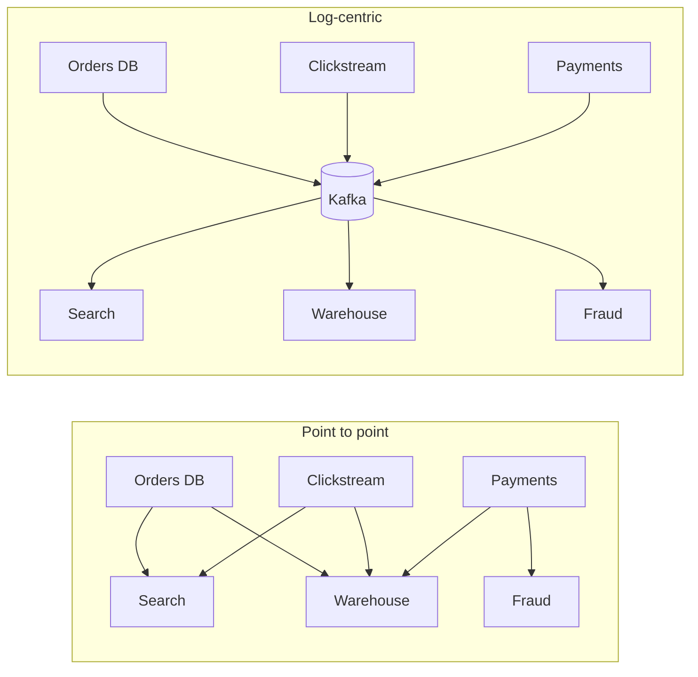

### 1.1 Common use cases

| Use case | Typical topics | Retention | Consumers | Notes |
| --- | --- | --- | --- | --- |
| Activity tracking | `page-views`, `clicks` | 7 days | Analytics, ML features | Highest volume, often keyless |
| Change data capture | `db.orders.cdc` | Compacted | Search, cache, warehouse | Debezium is the usual source |
| Metrics pipeline | `metrics.raw` | 3 days | TSDB sink | Small records, huge fan-in |
| Event sourcing | `account-events` | Infinite | Projections | Offsets are the source of truth |
| Log aggregation | `app-logs` | 2 days | Elasticsearch sink | Lossy tolerance is often fine |
| Stream processing | `enriched-orders` | 1 day | Downstream services | Output of Kafka Streams / Flink |
| Messaging / commands | `payment-commands` | 1 day | A single service | Consider idempotent consumers |
| Data integration | `connect-*` | Varies | Kafka Connect sinks | Schema Registry recommended |

## 2. The log abstraction

Every partition is an ordered, immutable sequence of records. A producer appends to the tail; consumers read from any offset they choose. That is the whole trick, and nearly every Kafka feature is a consequence of it.

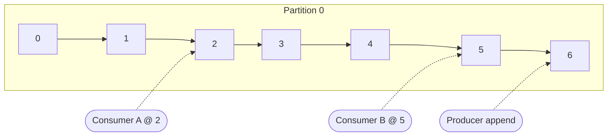

### 2.1 Segments and indexes

On disk, a partition is a directory of **segments**. Each segment has a `.log` file with the records, an `.index` mapping offsets to byte positions, and a `.timeindex` mapping timestamps to offsets. Only the newest segment, the *active* segment, is written to.

```text
/var/lib/kafka/data/orders-3/
├── 00000000000000000000.index
├── 00000000000000000000.log
├── 00000000000000000000.timeindex
├── 00000000000004718923.index
├── 00000000000004718923.log
├── 00000000000004718923.snapshot
├── 00000000000004718923.timeindex
├── leader-epoch-checkpoint
└── partition.metadata
```

| File | Purpose | Sparse? | Rebuilt on crash? |
| --- | --- | --- | --- |
| `.log` | Record batches, exactly as the producer sent them | No | No, it *is* the data |
| `.index` | Offset → file position | Yes, every `index.interval.bytes` | Yes |
| `.timeindex` | Timestamp → offset | Yes | Yes |
| `.snapshot` | Producer state for idempotence | No | From the log |
| `leader-epoch-checkpoint` | Epoch → start offset, for truncation | No | No |

> [!TIP]
> Because the `.log` file holds batches in the producer's wire format, brokers can hand them to consumers with `sendfile(2)` and never copy them through user space. This **zero-copy** path is a large part of why Kafka is fast.

### 2.2 Retention and compaction

Kafka supports two cleanup policies, and a topic can use both:

1. **`delete`**: drop whole segments older than `retention.ms` or once the partition exceeds `retention.bytes`.
2. **`compact`**: keep at least the *latest* value for every key; older values for the same key are eventually removed. A record with a `null` value is a **tombstone** that deletes the key after `delete.retention.ms`.

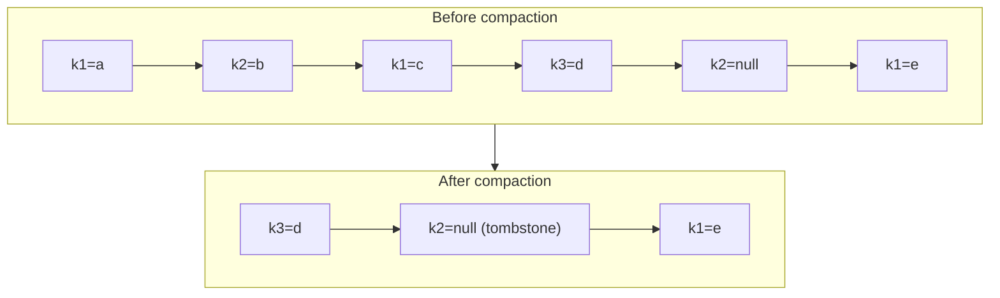

The cleaner thread picks the partition with the highest *dirty ratio*:

$$
\text{dirty ratio} = \frac{\text{bytes in dirty segments}}{\text{bytes in clean} + \text{bytes in dirty segments}}
$$

and cleans it once the ratio exceeds `min.cleanable.dirty.ratio` (default $0.5$).

## 3. Cluster architecture

A Kafka cluster is a set of **brokers**. In KRaft mode a subset of nodes also act as **controllers**, forming a Raft quorum that owns the cluster metadata log (`__cluster_metadata`). Brokers replicate that log and act on it.

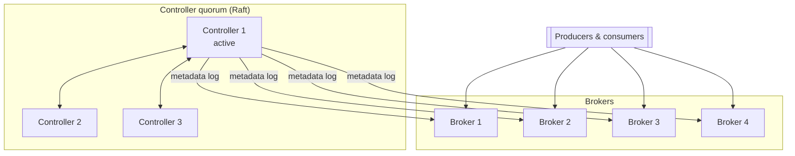

### 3.1 KRaft versus ZooKeeper

| Aspect | ZooKeeper mode | KRaft mode |
| --- | --- | --- |
| Metadata store | External ZooKeeper ensemble | Internal Raft log `__cluster_metadata` |
| Controller failover | Seconds to minutes on large clusters | Sub-second, standby controllers are hot |
| Partition limit (practical) | ~200k per cluster | Millions |
| Operational components | Two systems to secure, monitor, upgrade | One |
| Metadata propagation | Controller pushes RPCs to brokers | Brokers fetch the log like any follower |
| Status | Deprecated in 3.5, removed in 4.0 | Default since 3.3 for new clusters |

### 3.2 Replication

Each partition has a replication factor, usually 3. One replica is the **leader**; the others are **followers** that fetch from it. The set of replicas that are fully caught up is the **ISR** (in-sync replicas).

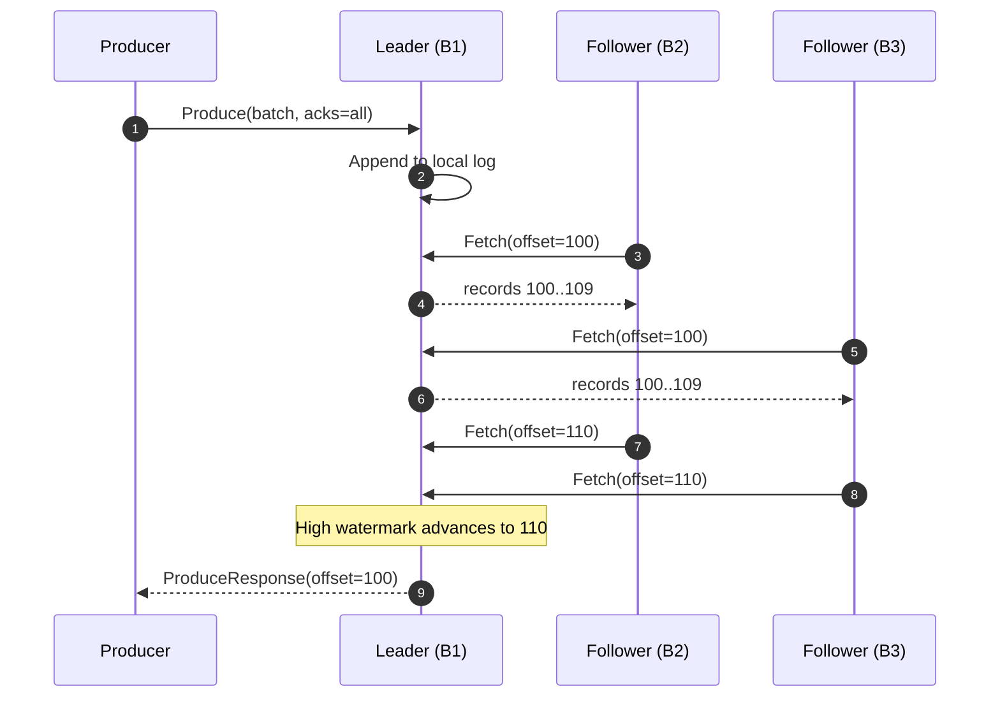

The **high watermark** (HW) is the offset up to which all ISR members have replicated. Consumers can only read below the HW, which is what makes an acknowledged write with `acks=all` durable across a leader failure.

> [!IMPORTANT]
> `acks=all` only means "all replicas *currently in the ISR*". If the ISR has shrunk to the leader alone, `acks=all` degrades to `acks=1`. Pair it with `min.insync.replicas=2` so the broker rejects writes instead of silently weakening durability.

### 3.3 Durability settings at a glance

| Setting | Scope | Recommended | Effect |
| --- | --- | --- | --- |
| `replication.factor` | Topic | 3 | Copies of every partition |
| `min.insync.replicas` | Topic / broker | 2 | Minimum ISR size for `acks=all` writes |
| `acks` | Producer | `all` | Wait for the ISR before acknowledging |
| `enable.idempotence` | Producer | `true` | No duplicates from producer retries |
| `unclean.leader.election.enable` | Topic / broker | `false` | Never elect an out-of-sync replica |
| `default.replication.factor` | Broker | 3 | For auto-created topics |
| `offsets.topic.replication.factor` | Broker | 3 | For `__consumer_offsets` |
| `transaction.state.log.replication.factor` | Broker | 3 | For `__transaction_state` |

## 4. Producers

A producer batches records per partition, compresses the batch, and sends it to the partition leader. The partitioner decides where each record goes.

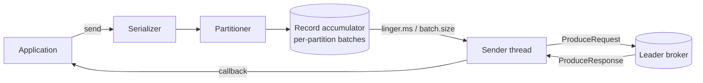

### 4.1 A minimal producer in Java

```java
import org.apache.kafka.clients.producer.*;
import org.apache.kafka.common.serialization.StringSerializer;
import java.util.Properties;

public class OrderProducer {
    public static void main(String[] args) {
        Properties props = new Properties();
        props.put(ProducerConfig.BOOTSTRAP_SERVERS_CONFIG, "broker-1:9092,broker-2:9092");
        props.put(ProducerConfig.KEY_SERIALIZER_CLASS_CONFIG, StringSerializer.class);
        props.put(ProducerConfig.VALUE_SERIALIZER_CLASS_CONFIG, StringSerializer.class);
        props.put(ProducerConfig.ACKS_CONFIG, "all");
        props.put(ProducerConfig.ENABLE_IDEMPOTENCE_CONFIG, true);
        props.put(ProducerConfig.LINGER_MS_CONFIG, 10);
        props.put(ProducerConfig.BATCH_SIZE_CONFIG, 64 * 1024);
        props.put(ProducerConfig.COMPRESSION_TYPE_CONFIG, "zstd");

        try (Producer<String, String> producer = new KafkaProducer<>(props)) {
            for (int i = 0; i < 1_000; i++) {
                String key = "customer-" + (i % 50);
                String value = "{\"orderId\":" + i + ",\"amount\":" + (i * 3.5) + "}";
                producer.send(new ProducerRecord<>("orders", key, value), (meta, err) -> {
                    if (err != null) {
                        System.err.println("send failed: " + err.getMessage());
                    }
                });
            }
            producer.flush();
        }
    }
}
```

### 4.2 The same producer in Python

```python
from confluent_kafka import Producer
import json

conf = {
    "bootstrap.servers": "broker-1:9092,broker-2:9092",
    "acks": "all",
    "enable.idempotence": True,
    "linger.ms": 10,
    "compression.type": "zstd",
}
producer = Producer(conf)

def delivery(err, msg):
    if err is not None:
        print(f"delivery failed for {msg.key()}: {err}")

for i in range(1000):
    key = f"customer-{i % 50}"
    value = json.dumps({"orderId": i, "amount": i * 3.5})
    producer.produce("orders", key=key, value=value, on_delivery=delivery)
    producer.poll(0)

producer.flush()
```

### 4.3 Partitioning

With a key, the default partitioner hashes it:

$$
p = \operatorname{murmur2}(\text{key}) \bmod N_{\text{partitions}}
$$

so every record for the same key lands in the same partition and stays ordered. Without a key, the **sticky partitioner** fills one batch at a time for a partition before switching, which produces fuller batches than round robin.

> [!WARNING]
> Adding partitions to an existing topic changes $N_{\text{partitions}}$ and therefore the key → partition mapping. Records for a key written before and after the change can land in different partitions, breaking per-key ordering. Over-provision partitions up front instead.

### 4.4 Producer tuning cheat sheet

| Parameter | Default | Throughput-oriented | Latency-oriented | Why |
| --- | --- | --- | --- | --- |
| `linger.ms` | 5 | 20 to 100 | 0 | Wait to fill batches |
| `batch.size` | 16 KiB | 128 to 512 KiB | 16 KiB | Max bytes per partition batch |
| `compression.type` | none | `zstd` or `lz4` | `lz4` | CPU for network and disk |
| `buffer.memory` | 32 MiB | 128 MiB+ | 32 MiB | Total unsent bytes |
| `max.in.flight.requests.per.connection` | 5 | 5 | 1 to 5 | Pipelining; ≤ 5 keeps idempotent ordering |
| `acks` | `all` | `all` | `1` | Durability versus latency |
| `delivery.timeout.ms` | 120000 | 120000 | 30000 | Upper bound on send + retries |
| `request.timeout.ms` | 30000 | 30000 | 15000 | Per-request wait |

## 5. Consumers and consumer groups

Consumers in the same **group** divide a topic's partitions among themselves: each partition is owned by exactly one member of the group at a time. Different groups are independent and each sees every record.

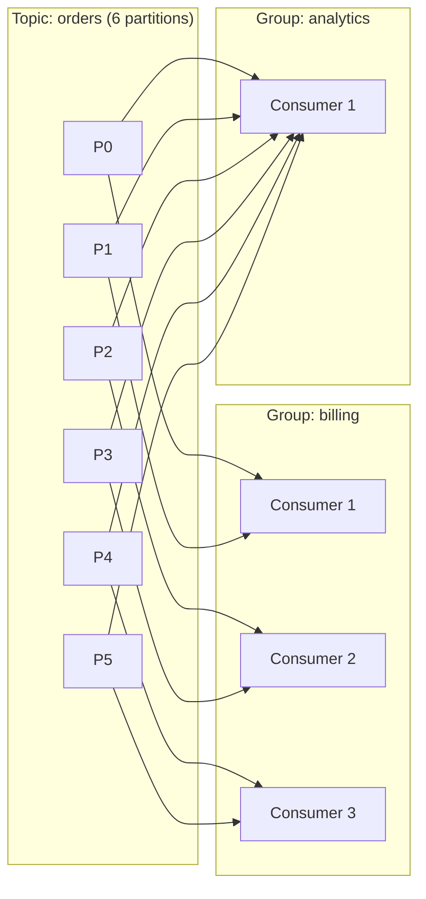

### 5.1 The poll loop

```java
Properties props = new Properties();
props.put(ConsumerConfig.BOOTSTRAP_SERVERS_CONFIG, "broker-1:9092");
props.put(ConsumerConfig.GROUP_ID_CONFIG, "billing");
props.put(ConsumerConfig.ENABLE_AUTO_COMMIT_CONFIG, false);
props.put(ConsumerConfig.AUTO_OFFSET_RESET_CONFIG, "earliest");
props.put(ConsumerConfig.GROUP_PROTOCOL_CONFIG, "consumer");

try (KafkaConsumer<String, String> consumer = new KafkaConsumer<>(props, new StringDeserializer(), new StringDeserializer())) {
    consumer.subscribe(List.of("orders"));
    while (running) {
        ConsumerRecords<String, String> records = consumer.poll(Duration.ofMillis(500));
        for (ConsumerRecord<String, String> r : records) {
            billing.charge(r.key(), r.value());
        }
        consumer.commitSync();
    }
}
```

### 5.2 Rebalancing

When a member joins, leaves, or misses its session timeout, the group **rebalances**. Kafka has had three generations of rebalance protocol:

| Protocol | Introduced | Stop-the-world? | Coordinator role | Notes |
| --- | --- | --- | --- | --- |
| Eager (classic) | 0.9 | Yes, all partitions revoked | Picks a leader member | Simple, disruptive |
| Incremental cooperative | 2.4 | No, only moved partitions revoked | Same as eager | Needs `CooperativeStickyAssignor` |
| Next-gen (KIP-848) | 3.7 preview, 4.0 GA | No | Broker computes assignment | `group.protocol=consumer` |

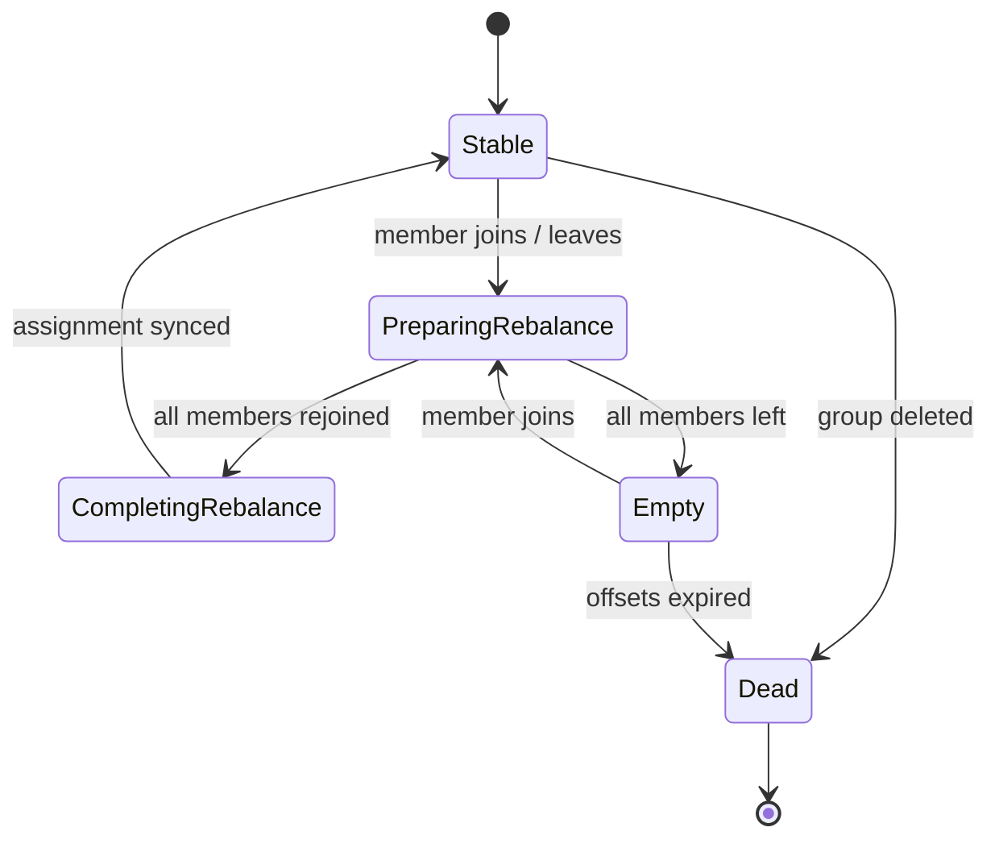

### 5.3 Consumer lag

**Lag** is how far a consumer is behind the end of the log:

$$
\text{lag}_p = \text{LEO}_p - \text{committed}_p
\qquad
\text{total lag} = \sum_{p \in P} \text{lag}_p
$$

where $\text{LEO}_p$ is the log end offset of partition $p$. A more useful number for alerting is *time* lag, which you can estimate as

$$
t_{\text{lag}} \approx \frac{\text{total lag}}{\text{consume rate (records/s)}}
$$

> [!CAUTION]
> Monitoring record lag alone is misleading for topics with bursty traffic. A lag of 10,000 records is nothing on a topic doing 1M records/s and a disaster on one doing 10 records/s.

### 5.4 Offset management strategies

- [x] Disable auto commit for anything that must not lose records
- [x] Commit **after** processing, never before
- [ ] Store offsets transactionally with the output when the sink supports it
- [ ] Handle `CommitFailedException` by re-polling, not by crashing
- [ ] Use `seek()` for replay instead of resetting the group with the CLI while it is running
- [ ] Alert on lag *growth* rate, not only absolute lag

## 6. Delivery semantics

| Guarantee | Producer config | Consumer pattern | Failure mode avoided | Cost |
| --- | --- | --- | --- | --- |
| At most once | `acks=0` or commit before processing | Commit, then process | Duplicates | Data loss possible |
| At least once | `acks=all`, retries | Process, then commit | Loss | Duplicates possible |
| Exactly once (within Kafka) | Idempotence + transactions | `read_committed`, `sendOffsetsToTransaction` | Loss and duplicates | ~3 to 5% throughput |
| Effectively once (external sink) | At least once | Idempotent writes keyed by offset | Duplicate side effects | Sink must support upsert |

### 6.1 Transactions

A transactional producer can write to several partitions *and* commit consumer offsets atomically. Consumers with `isolation.level=read_committed` never see records from aborted transactions.

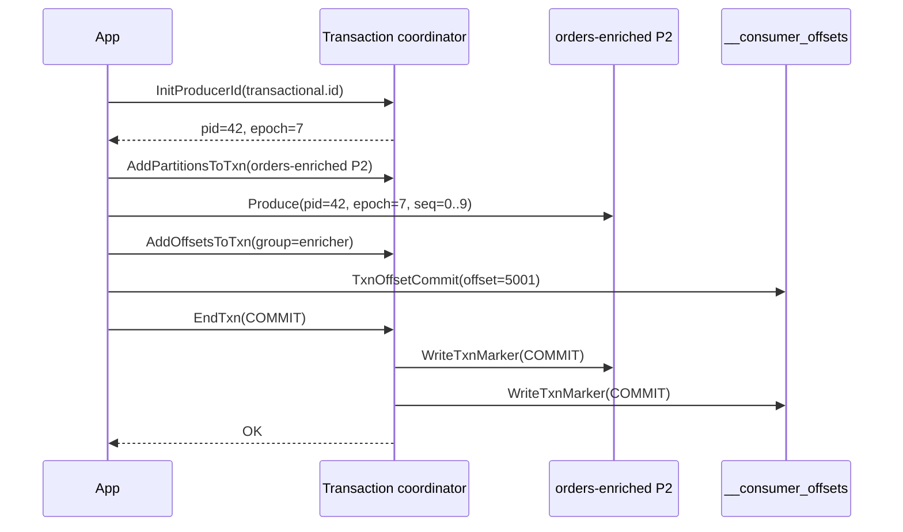

```java
producer.initTransactions();
while (running) {
    ConsumerRecords<String, Order> batch = consumer.poll(Duration.ofMillis(200));
    if (batch.isEmpty()) continue;
    producer.beginTransaction();
    try {
        for (ConsumerRecord<String, Order> r : batch) {
            producer.send(new ProducerRecord<>("orders-enriched", r.key(), enrich(r.value())));
        }
        producer.sendOffsetsToTransaction(nextOffsets(batch), consumer.groupMetadata());
        producer.commitTransaction();
    } catch (ProducerFencedException | OutOfOrderSequenceException e) {
        producer.close();
        throw e;
    } catch (KafkaException e) {
        producer.abortTransaction();
        rewind(consumer, batch);
    }
}
```

## 7. Topic design

### 7.1 How many partitions?

A common starting point is to size for the target throughput $T$ given per-partition producer throughput $p$ and consumer throughput $c$:

$$
N \ge \max\!\left(\frac{T}{p}, \frac{T}{c}\right)
$$

then round up generously for growth, because increasing partitions later breaks key ordering (see [§4.3](#43-partitioning)).

| Target throughput | Per-partition consume rate | Minimum partitions | Suggested |
| --- | --- | --- | --- |
| 5 MB/s | 10 MB/s | 1 | 6 |
| 50 MB/s | 10 MB/s | 5 | 12 |
| 200 MB/s | 10 MB/s | 20 | 32 |
| 1 GB/s | 20 MB/s | 50 | 96 |
| 5 GB/s | 25 MB/s | 200 | 256 |

### 7.2 Naming conventions

A predictable naming scheme pays for itself in ACLs, quotas, and dashboards. One convention that scales:

```text
<domain>.<dataset>.<event-type>.<version>

payments.card.authorized.v1
payments.card.captured.v1
inventory.sku.reserved.v2
identity.user.profile-updated.v1
```

### 7.3 Topic configuration reference

| Config | Default | Common override | When to change |
| --- | --- | --- | --- |
| `cleanup.policy` | `delete` | `compact` / `compact,delete` | Changelog and state topics |
| `retention.ms` | 604800000 (7d) | 86400000 to -1 | Per compliance and replay needs |
| `retention.bytes` | -1 | Per disk budget | Bounded disks |
| `segment.bytes` | 1 GiB | 256 MiB | Faster retention granularity |
| `segment.ms` | 7 days | 1 day | Low-volume compacted topics |
| `max.message.bytes` | ~1 MiB | 5 to 10 MiB | Large payloads (prefer claim check) |
| `min.insync.replicas` | 1 | 2 | Always, for durable topics |
| `message.timestamp.type` | `CreateTime` | `LogAppendTime` | Untrusted producer clocks |
| `min.compaction.lag.ms` | 0 | Minutes to hours | Let consumers see intermediate values |
| `delete.retention.ms` | 1 day | Longer than max consumer downtime | Tombstone visibility |
| `compression.type` | `producer` | `zstd` | Force broker-side recompression |
| `local.retention.ms` | -2 | Hours | Tiered storage hot window |

## 8. Schemas and data contracts

Unstructured JSON on a shared topic eventually turns into an incident. A **Schema Registry** stores versioned Avro, Protobuf, or JSON Schema definitions, and serializers embed a schema id in every record.

```json
{
  "type": "record",
  "name": "OrderPlaced",
  "namespace": "com.example.orders",
  "fields": [
    { "name": "orderId", "type": "string" },
    { "name": "customerId", "type": "string" },
    { "name": "amount", "type": { "type": "bytes", "logicalType": "decimal", "precision": 12, "scale": 2 } },
    { "name": "currency", "type": "string", "default": "EUR" },
    { "name": "placedAt", "type": { "type": "long", "logicalType": "timestamp-millis" } },
    { "name": "coupon", "type": ["null", "string"], "default": null }
  ]
}
```

| Compatibility mode | Allowed changes | Upgrade order |
| --- | --- | --- |
| `BACKWARD` (default) | Delete fields, add optional fields | Consumers first |
| `FORWARD` | Add fields, delete optional fields | Producers first |
| `FULL` | Add or delete optional fields | Any order |
| `NONE` | Anything | Coordinated big bang |
| `*_TRANSITIVE` | As above, checked against all versions | As above |

The wire format is small and fixed:

| Byte(s) | Content |
| --- | --- |
| 0 | Magic byte `0x0` |
| 1 to 4 | Schema id (big endian int32) |
| 5 to end | Serialized payload |

## 9. Kafka Connect

Connect runs **source** connectors (external system → Kafka) and **sink** connectors (Kafka → external system) on a cluster of workers, handling offsets, retries, and scaling for you.

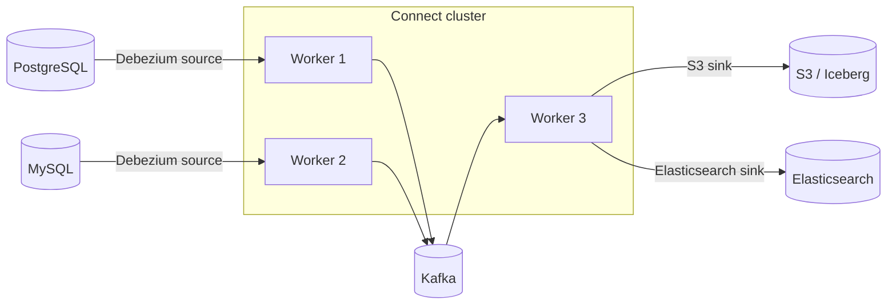

```json
{
  "name": "orders-cdc",
  "config": {
    "connector.class": "io.debezium.connector.postgresql.PostgresConnector",
    "database.hostname": "orders-db.internal",
    "database.port": "5432",
    "database.user": "debezium",
    "database.dbname": "orders",
    "topic.prefix": "db",
    "table.include.list": "public.orders,public.order_items",
    "plugin.name": "pgoutput",
    "key.converter": "io.confluent.connect.avro.AvroConverter",
    "value.converter": "io.confluent.connect.avro.AvroConverter",
    "transforms": "unwrap",
    "transforms.unwrap.type": "io.debezium.transforms.ExtractNewRecordState"
  }
}
```

<details>
<summary>Single message transforms worth knowing</summary>

| SMT | What it does |
| --- | --- |
| `InsertField` | Adds topic, partition, offset, or a static value |
| `ReplaceField` | Renames, includes, or excludes fields |
| `MaskField` | Replaces a field with a type-appropriate null |
| `TimestampRouter` | Routes to a topic named from the record timestamp |
| `RegexRouter` | Renames the destination topic with a regex |
| `Filter` + predicate | Drops records matching a condition |
| `ExtractNewRecordState` | Flattens Debezium envelopes to the new row |

</details>

## 10. Stream processing with Kafka Streams

Kafka Streams is a *library*, not a cluster. Your application instances form a consumer group; state lives in local RocksDB stores backed by compacted **changelog** topics.

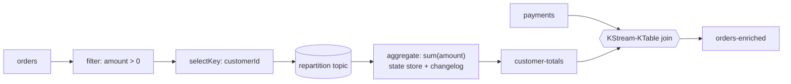

```java
StreamsBuilder builder = new StreamsBuilder();

KStream<String, Order> orders = builder.stream("orders", Consumed.with(Serdes.String(), orderSerde));

KTable<String, BigDecimal> totals = orders
    .filter((k, o) -> o.amount().signum() > 0)
    .selectKey((k, o) -> o.customerId())
    .groupByKey(Grouped.with(Serdes.String(), orderSerde))
    .aggregate(
        () -> BigDecimal.ZERO,
        (customer, order, total) -> total.add(order.amount()),
        Materialized.<String, BigDecimal, KeyValueStore<Bytes, byte[]>>as("customer-totals")
            .withValueSerde(decimalSerde));

totals.toStream().to("customer-totals", Produced.with(Serdes.String(), decimalSerde));
```

### 10.1 Windowing

| Window type | Size | Advance | Overlap | Example |
| --- | --- | --- | --- | --- |
| Tumbling | Fixed | = size | None | Orders per minute |
| Hopping | Fixed | < size | Yes | 5-minute average every minute |
| Sliding | Fixed | Event-driven | Yes | Fraud: > 3 payments within 10s |
| Session | Dynamic | Inactivity gap | No | User sessions with 30-min gap |

For a hopping window of size $s$ and advance $a$, each record belongs to $\lceil s / a \rceil$ windows, so memory grows linearly with that ratio.

## 11. Operations

### 11.1 Sizing a cluster

Disk per broker, for replication factor $R$, write rate $W$ (bytes/s), retention $t$ (seconds), and $B$ brokers, with headroom factor $h$:

$$
D_{\text{broker}} = \frac{W \cdot t \cdot R \cdot h}{B}
$$

With $W = 100\,\text{MB/s}$, $t = 3\,\text{days}$, $R = 3$, $h = 1.4$, and $B = 12$:

$$
D_{\text{broker}} = \frac{100 \times 259{,}200 \times 3 \times 1.4}{12} \approx 9.07\,\text{TB}
$$

Network egress per broker is dominated by replication and fan-out: with $F$ consumer groups reading everything,

$$
E_{\text{broker}} \approx \frac{W \cdot (R - 1 + F)}{B}
$$

### 11.2 Broker configuration

```properties
# server.properties (KRaft combined-mode excerpt)
process.roles=broker,controller
node.id=1
controller.quorum.voters=1@kafka-1:9093,2@kafka-2:9093,3@kafka-3:9093
listeners=PLAINTEXT://:9092,CONTROLLER://:9093
inter.broker.listener.name=PLAINTEXT
controller.listener.names=CONTROLLER
log.dirs=/var/lib/kafka/data
num.partitions=12
default.replication.factor=3
min.insync.replicas=2
unclean.leader.election.enable=false
auto.create.topics.enable=false
num.network.threads=8
num.io.threads=16
socket.send.buffer.bytes=1048576
socket.receive.buffer.bytes=1048576
log.retention.hours=168
log.segment.bytes=1073741824
group.initial.rebalance.delay.ms=3000
```

### 11.3 Deploying on Kubernetes

```yaml
apiVersion: kafka.strimzi.io/v1beta2
kind: Kafka
metadata:
  name: events
  namespace: streaming
  annotations:
    strimzi.io/kraft: enabled
    strimzi.io/node-pools: enabled
spec:
  kafka:
    version: 3.8.0
    listeners:
      - name: tls
        port: 9093
        type: internal
        tls: true
        authentication:
          type: tls
    config:
      default.replication.factor: 3
      min.insync.replicas: 2
      offsets.topic.replication.factor: 3
      transaction.state.log.replication.factor: 3
    metricsConfig:
      type: jmxPrometheusExporter
      valueFrom:
        configMapKeyRef:
          name: kafka-metrics
          key: kafka-metrics-config.yml
  entityOperator:
    topicOperator: {}
    userOperator: {}
```

### 11.4 Everyday CLI

```bash
# Create a topic with 12 partitions, RF 3, and a durable ISR floor
kafka-topics.sh --bootstrap-server kafka-1:9092 \
  --create --topic orders --partitions 12 --replication-factor 3 \
  --config min.insync.replicas=2

# Describe it, including under-replicated partitions
kafka-topics.sh --bootstrap-server kafka-1:9092 --describe --topic orders
kafka-topics.sh --bootstrap-server kafka-1:9092 --describe --under-replicated-partitions

# Consumer group lag
kafka-consumer-groups.sh --bootstrap-server kafka-1:9092 --describe --group billing

# Replay a group to a point in time (group must be inactive)
kafka-consumer-groups.sh --bootstrap-server kafka-1:9092 --group billing \
  --topic orders --reset-offsets --to-datetime 2026-09-01T00:00:00.000 --execute

# Tail a topic with keys and timestamps
kafka-console-consumer.sh --bootstrap-server kafka-1:9092 --topic orders \
  --from-beginning --property print.key=true --property print.timestamp=true
```

### 11.5 Metrics that matter

| Metric (JMX) | Healthy value | Alert when | Meaning |
| --- | --- | --- | --- |
| `UnderReplicatedPartitions` | 0 | > 0 for 5 min | Followers not keeping up |
| `UnderMinIsrPartitionCount` | 0 | > 0 | `acks=all` writes are failing |
| `OfflinePartitionsCount` | 0 | > 0 | No leader; data unavailable |
| `ActiveControllerCount` | 1 across cluster | ≠ 1 | Split brain or no controller |
| `RequestHandlerAvgIdlePercent` | > 0.3 | < 0.2 | I/O threads saturated |
| `NetworkProcessorAvgIdlePercent` | > 0.3 | < 0.2 | Network threads saturated |
| `RequestQueueTimeMs` (p99) | < 10 ms | > 50 ms | Broker overloaded |
| `LocalTimeMs` Produce (p99) | < 20 ms | > 100 ms | Slow disk |
| `records-lag-max` (consumer) | Stable | Growing | Consumer falling behind |
| `IsrShrinksPerSec` | ~0 | Sustained | Flapping followers |
| `LogFlushRateAndTimeMs` | Low | Spiking | fsync pressure |
| `BytesInPerSec` / `BytesOutPerSec` | Within NIC budget | > 70% of NIC | Network saturation |

### 11.6 Incident runbook: under-replicated partitions

1. Check whether the URPs are concentrated on **one broker**. If so, that broker is the problem: disk, GC, or network.
2. Look at `RequestHandlerAvgIdlePercent` and disk `await` on that broker.
3. Check for a recent partition reassignment that is saturating replication traffic; throttle it with `leader.replication.throttled.rate`.
4. If a broker is down, confirm the controller moved leadership (offline partitions should be zero).
5. Only as a last resort, and only with explicit sign-off, consider unclean leader election for a partition that must come back[^unclean].

[^unclean]: Unclean leader election can elect a replica that is missing acknowledged writes. Those records are permanently lost, and consumers may observe offsets going backwards.

## 12. Security

| Layer | Mechanism | Configure on | Notes |
| --- | --- | --- | --- |
| Encryption in transit | TLS | Listeners, clients | Costs zero-copy on the TLS listener |
| Authentication | mTLS, SASL/SCRAM, SASL/OAUTHBEARER, SASL/GSSAPI | Listeners | Prefer OAUTHBEARER or mTLS |
| Authorization | ACLs (`StandardAuthorizer` in KRaft) | Cluster | Deny by default with `allow.everyone.if.no.acl.found=false` |
| Quotas | Byte-rate and request-rate quotas | Users / client ids | Protects the cluster from noisy tenants |
| Encryption at rest | Disk / volume encryption | OS / cloud | Kafka has no native at-rest encryption |
| Audit | Authorizer logs | Log4j | Ship to SIEM |

```bash
kafka-acls.sh --bootstrap-server kafka-1:9093 --command-config admin.properties \
  --add --allow-principal User:billing-svc \
  --operation Read --operation Describe \
  --topic orders --group billing
```

## 13. Tiered storage

Tiered storage (KIP-405) moves closed segments to object storage and keeps only a hot window on local disk. Brokers become cheaper to replace and retention can grow without adding disks.

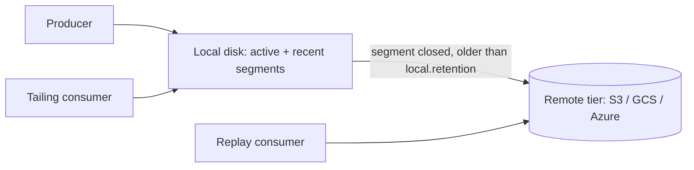

| Property | Local only | Tiered |
| --- | --- | --- |
| Broker disk | Sized for full retention | Sized for hot window |
| Broker replacement time | Hours (re-replication) | Minutes |
| Historical read latency | Disk | Object store, higher |
| Cost per TB-month | Block storage | Object storage, ~4 to 10× cheaper |
| Compacted topics | Supported | Not supported |

## 14. Kafka compared

| Feature | Kafka | RabbitMQ | Pulsar | Kinesis | Redpanda |
| --- | --- | --- | --- | --- | --- |
| Model | Partitioned log | Queues / exchanges | Segmented log + BookKeeper | Sharded stream | Partitioned log |
| Replay | Yes, by offset | Streams only | Yes | 24h to 365d | Yes |
| Ordering | Per partition | Per queue | Per partition / key | Per shard | Per partition |
| Consumer scaling | Partitions per group | Competing consumers | Shared subscriptions | Shards | Partitions per group |
| Exactly once | Yes (transactions) | No | Yes | No | Yes |
| Language | JVM | Erlang | JVM | Managed | C++ |
| Protocol | Kafka | AMQP 0.9.1 / 1.0 | Pulsar, Kafka (KoP) | HTTP | Kafka |
| Multi-tenancy | Quotas, ACLs | vhosts | Native tenants / namespaces | Accounts | Quotas, ACLs |
| Geo replication | MirrorMaker 2 / Cluster Linking | Shovel / Federation | Native | Cross-region manually | Remote read replicas |

## 15. Glossary

Broker
: A Kafka server that stores partitions and serves clients.

ISR
: In-sync replicas: replicas fully caught up with the leader.

LEO
: Log end offset: the offset of the next record to be written.

HW
: High watermark: the highest offset replicated to all of the ISR.

Epoch
: A counter that increments on every leader change, used to fence stale leaders.

| Term | Short definition | See |
| --- | --- | --- |
| Offset | Position of a record in a partition | [§2](#2-the-log-abstraction) |
| Segment | One file of a partition's log | [§2.1](#21-segments-and-indexes) |
| Tombstone | A `null` value that deletes a key under compaction | [§2.2](#22-retention-and-compaction) |
| Controller | Node that owns cluster metadata | [§3](#3-cluster-architecture) |
| Consumer group | Consumers sharing a topic's partitions | [§5](#5-consumers-and-consumer-groups) |
| Transactional id | Stable id that fences zombie producers | [§6.1](#61-transactions) |
| Changelog | Compacted topic backing a state store | [§10](#10-stream-processing-with-kafka-streams) |

## 16. A worked example: order pipeline

The rest of this document walks through a realistic pipeline end to end: orders arrive from a web app, are enriched with customer data, fraud-scored, and landed in a warehouse.

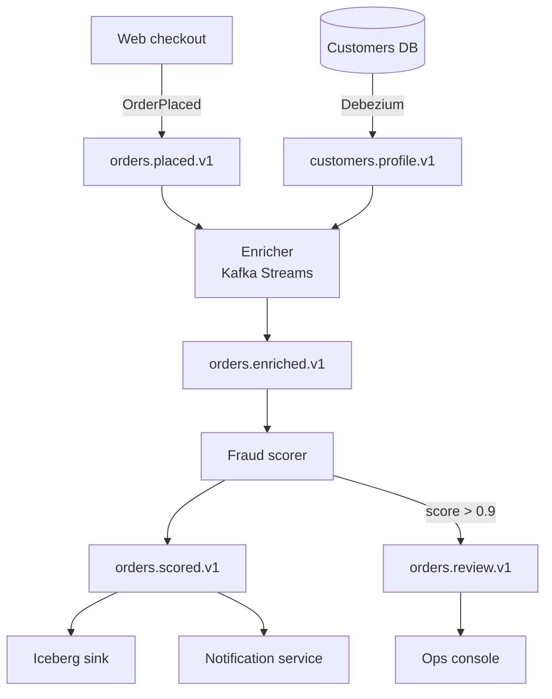

### 16.1 Service ownership

| Service | Team | Input topics | Output topics | SLO (p99 end to end) | On-call |
| --- | --- | --- | --- | --- | --- |
| Checkout | Web | n/a | `orders.placed.v1` | 150 ms | web-oncall |
| Enricher | Platform | `orders.placed.v1`, `customers.profile.v1` | `orders.enriched.v1` | 500 ms | platform-oncall |
| Fraud scorer | Risk | `orders.enriched.v1` | `orders.scored.v1`, `orders.review.v1` | 800 ms | risk-oncall |
| Notifications | Growth | `orders.scored.v1` | n/a | 5 s | growth-oncall |
| Warehouse sink | Data | `orders.scored.v1` | Iceberg `orders` | 15 min | data-oncall |
| Ops console | Risk | `orders.review.v1` | n/a | 1 min | risk-oncall |

### 16.2 Launch checklist

- [x] Topics created by Terraform with RF 3 and `min.insync.replicas=2`
- [x] Schemas registered with `BACKWARD_TRANSITIVE`
- [x] ACLs scoped per service principal
- [x] Producers use idempotence and `acks=all`
- [ ] Enricher uses exactly-once v2 (`processing.guarantee=exactly_once_v2`)
- [ ] Lag alerts wired to each on-call rotation
- [ ] Load test at 3× projected peak
- [ ] Chaos test: kill a broker during peak, confirm zero URPs within 10 min
- [ ] Runbook reviewed by every owning team
- [ ] Rollback plan: dual-write window of 7 days

### 16.3 Load test results

| Scenario | Producers | Rate (msg/s) | Payload | p50 latency | p99 latency | p99.9 latency | Errors |
| --- | --- | --- | --- | --- | --- | --- | --- |
| Baseline | 4 | 20,000 | 1 KiB | 3 ms | 11 ms | 24 ms | 0 |
| 2× peak | 8 | 40,000 | 1 KiB | 4 ms | 15 ms | 41 ms | 0 |
| 3× peak | 12 | 60,000 | 1 KiB | 6 ms | 28 ms | 97 ms | 0 |
| 3× peak, zstd | 12 | 60,000 | 1 KiB | 5 ms | 19 ms | 52 ms | 0 |
| Broker kill | 12 | 60,000 | 1 KiB | 7 ms | 212 ms | 1,480 ms | 0 |
| Large payloads | 4 | 2,000 | 256 KiB | 18 ms | 64 ms | 190 ms | 0 |
| Cold replay | 1 consumer | 450,000 | 1 KiB | n/a | n/a | n/a | 0 |

Throughput scaled nearly linearly up to 3× peak. The broker kill scenario shows the expected latency spike while leadership moved; no acknowledged record was lost, which we verified by comparing producer callbacks against a full replay :white_check_mark:.

### 16.4 Lessons learned

1. **Partition count is a one-way door.** We started `orders.placed.v1` with 6 partitions and had to migrate to a new topic with 48. Start bigger.
2. **Consumer lag in seconds is the only lag number humans understand.** Records-behind was ignored by every on-call until we converted it.
3. **Schema compatibility saved us twice**: once when a team tried to rename `amount` to `total`, and once when someone made `currency` required.
4. ==Idempotent consumers are not optional.== Even with exactly-once inside Kafka, the notification service still sent duplicate emails after a rebalance until it deduplicated on `orderId`.
5. Tiered storage cut broker disk by ~80% but replay from the remote tier is ~5× slower; size the local window for your common replay depth.

> "A log is perhaps the simplest possible storage abstraction. It is an append-only, totally-ordered sequence of records ordered by time."
> Jay Kreps, *The Log*[^log]

[^log]: Jay Kreps, "The Log: What every software engineer should know about real-time data's unifying abstraction", 2013.

## 17. Appendix A: configuration matrix

| Config | Broker | Topic | Producer | Consumer | Streams | Default |
| --- | :-: | :-: | :-: | :-: | :-: | --- |
| `compression.type` | ✓ | ✓ | ✓ |  | ✓ | varies |
| `min.insync.replicas` | ✓ | ✓ |  |  |  | 1 |
| `retention.ms` | ✓ | ✓ |  |  |  | 7d |
| `acks` |  |  | ✓ |  | ✓ | all |
| `enable.idempotence` |  |  | ✓ |  | ✓ | true |
| `isolation.level` |  |  |  | ✓ | ✓ | read_uncommitted |
| `max.poll.records` |  |  |  | ✓ | ✓ | 500 |
| `max.poll.interval.ms` |  |  |  | ✓ | ✓ | 300000 |
| `session.timeout.ms` |  |  |  | ✓ | ✓ | 45000 |
| `fetch.min.bytes` |  |  |  | ✓ | ✓ | 1 |
| `fetch.max.wait.ms` |  |  |  | ✓ | ✓ | 500 |
| `num.stream.threads` |  |  |  |  | ✓ | 1 |
| `commit.interval.ms` |  |  |  |  | ✓ | 30000 |
| `processing.guarantee` |  |  |  |  | ✓ | at_least_once |
| `num.standby.replicas` |  |  |  |  | ✓ | 0 |
| `unclean.leader.election.enable` | ✓ | ✓ |  |  |  | false |
| `message.max.bytes` | ✓ |  |  |  |  | 1 MiB |
| `max.message.bytes` |  | ✓ |  |  |  | 1 MiB |
| `max.request.size` |  |  | ✓ |  |  | 1 MiB |
| `fetch.max.bytes` |  |  |  | ✓ |  | 50 MiB |

## 18. Appendix B: failure scenarios

| # | Failure | Detection | Automatic recovery | Data loss? | Operator action |
| --- | --- | --- | --- | --- | --- |
| 1 | Single broker crash | Controller heartbeat | Leaders move to ISR followers | No | Replace broker |
| 2 | Disk full on one broker | `log.dirs` offline | Partitions on that dir go offline | No, with RF 3 | Free space, restart |
| 3 | Network partition isolates leader | ISR shrink, fencing by epoch | New leader elected | No, with `acks=all` | Investigate network |
| 4 | Two of three replicas lost | `UnderMinIsr` | Writes rejected | No | Restore brokers |
| 5 | All replicas lost | `OfflinePartitions` | None | Possibly | Restore, or unclean election |
| 6 | Controller quorum loses majority | No active controller | None for metadata changes | No | Restore controllers |
| 7 | Consumer stuck in processing | `max.poll.interval.ms` exceeded | Member evicted, rebalance | No | Fix slow handler |
| 8 | Poison pill record | Consumer crash loop | None | No | Skip with DLQ |
| 9 | Producer zombie after failover | Epoch fencing | Old producer fenced | No | None |
| 10 | Clock skew on producers | Odd timestamps | None | No | `LogAppendTime` |

---

*End of fixture.* Word count, outline, and every rendered construct above are exercised by Sarala's rendering performance benchmark in `tests/perf-render.mjs`. :rocket:
